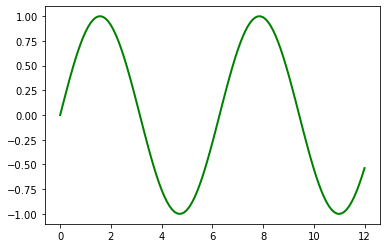
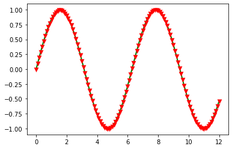
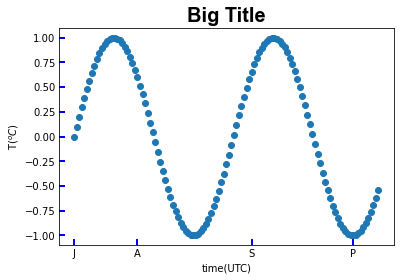
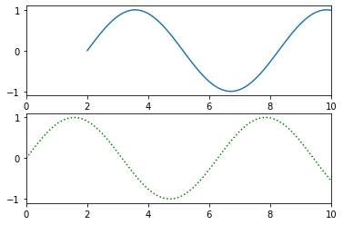
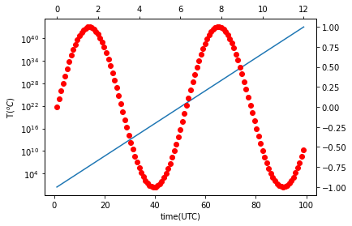

# import


```python
import matplotlib
import matplotlib.pyplot as plt
import numpy as np
```

# data


```python
x = np.arange(0,12.1,0.1)
y = np.sin(x)
```

# plot


```python
plt.plot(x,y,'g-',linewidth=2)
```


    [<matplotlib.lines.Line2D at 0x85652e0>]


    

    


```python
plt.plot(x,y,'g-',linewidth=2,marker='v',markerfacecolor='black',markeredgecolor='red', \
        markersize=3,markeredgewidth=3)
```


    [<matplotlib.lines.Line2D at 0x861edc0>]


    

    


```python
plt.scatter(x,y)
ax1 = plt.gca()
ax1.set_title('Big Title', fontname='Arial', fontsize=20, \
             weight='bold')
ax1.set_xlabel('time(UTC)')
ax1.set_ylabel('T($^oC$)')

ax1.set_xticks([0,2.5,7,11])
ax1.set_xticklabels(['J','A','S','P'])

ax1.tick_params(axis='both', direction='in', color='b', \
               length=6, width=2)
```


    

    


```python
plt.plot(x,y, '-.', label='Strange')
plt.plot(x+2,y, label='Normal')

# plt.legend()
plt.legend(loc='best')
```


    <matplotlib.legend.Legend at 0x9c3b760>


    

    


```python
fig, ax=plt.subplots(2,1)

ax[1].plot(x,y,'g:')
# ax[1].plot(x,y,'g:')
ax[0].plot(x+2,y)

ax[0].set_xlim([0,10])
ax[1].set_xlim([0,10])

```


    (0.0, 10.0)


    

    


```python
x2 = np.arange(1,100,1)
y2 = np.exp(x2)

```


```python
plt.plot(x2,y2)
ax = plt.gca()
ax.set_yscale('log')
```


    

    


```python
plt.plot(x2,y2)
ax = plt.gca()
ax.set_yscale('log')

ax2 = ax.twinx()
# ax2.plot(x,y,'ro')

ax3 = ax2.twiny()
ax3.plot(x,y,'ro')

ax.set_xlabel('time(UTC)')
ax.set_ylabel('T($^oC$)')

plt.savefig('./Big Title.png')
```


    

    

