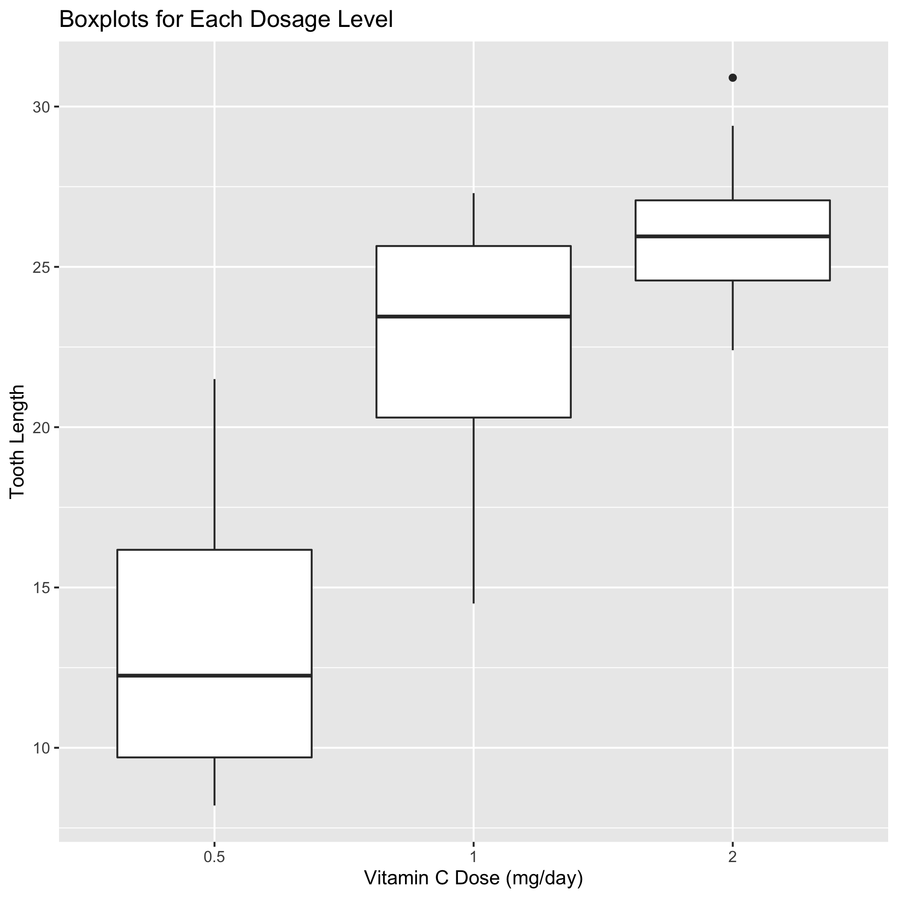
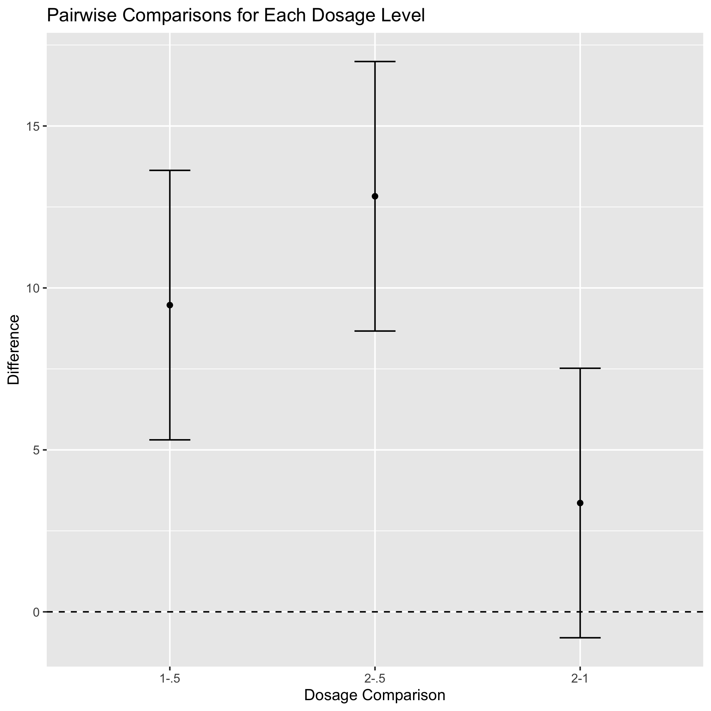

This post provides a simple example of a oneway ANOVA using the `ToothGrowth` dataset in `R`. More detailed information about the oneway ANOVA model and how it works can be found [here](https://trgrimm.github.io/posts/2023/01/what-is-anova/).

# Tooth Growth Example

A simple example of a oneway ANOVA would be an experiment to determine
the effect of various levels of a treatment on a response variable of
interest for some population. For this analysis, I will be using the
`ToothGrowth` dataset. This dataset is a part of base and can be seen by
simply typing `ToothGrowth` into the console window. Below is the
description of this dataset provided by typing `?ToothGrowth`:

> “The response is the length of odontoblasts (cells responsible for
> tooth growth) in 60 guinea pigs. Each animal received one of three
> dose levels of vitamin C (0.5, 1, and 2 mg/day) by one of two delivery
> methods, orange juice or ascorbic acid (a form of vitamin C and coded
> as VC).”

Recall that the [oneway ANOVA
model](https://trgrimm.github.io/posts/2023/01/what-is-anova/) is given
by the following:

$$
y_{ij} = \theta_i + \epsilon_{ij}, \qquad i = 1,\ldots, k, \textrm{ and } j = 1,\ldots,n_i,
$$

where $y_{ij}$ denotes the observed response for subject *j*
within treatment *i*, $\theta_i$ is the mean of the response for
treatment *i*, and $\epsilon_{ij}$ is random error for each subject
and treatment.

For our guinea pig application, we only consider guinea pigs that
receive different doses of vitamin C via orange juice, which results the
following oneway ANOVA model:

$$
growth_{ij} = dose_i + \epsilon_{ij}, \qquad i = 1,\ldots, 3, \textrm{ and } j = 1,\ldots,10,
$$

where *y* is the measured odontoblast length (*g**r**o**w**t**h*), *i*
denotes the dosage level (*d**o**s**e*: 0.5, 1, or 2 mg/day), and *j*
denotes the number of guinea pigs per group, which is 10 (for a total of
30 across the 3 levels of `dose`).

Simply put, our goal is to determine if the level of tooth growth in
guinea pigs is different between groups with different Vitamin C dosage
levels. To simplify this analysis to a oneway ANOVA, recall that we are
only using the subset of the guinea pig data corresponding to the orange
juice delivery method. A more complete analysis would be a twoway ANOVA
that considers both the dosage levels *and* the delivery method.

## Exploratory Data Analysis

As is necessary before performing any analysis, we can now load in any
packages we’ll be using and set up the data so it can be used for
plotting and analysis.

    library(tidyverse)
    library(kableExtra)

    # We can use the data() function to load the ToothGrowth dataset into our global environment
    data('ToothGrowth')

    # Dose is initially stored as a numeric (double) vector, but for the purposes of our
    # analysis, we want dose to be a factor variable
    ToothGrowth$dose <- as.factor(ToothGrowth$dose)

Now, let’s look at a few random rows of the dataset to make sure
everything is loaded in properly. The `gt` package gives us a nice way
to make tables in RMarkdown that are more visually appealing than raw
output, and from the `dplyr` package (part of the `tidyverse`) lets us
easily select 10 random rows from the dataset to view. In this analysis,
we only consider data corresponding to guinea pigs that were not
assigned to the orange juice supplement group. However, the table below
includes data for all guinea pigs in the experiment.

    ToothGrowth |> 
      as_tibble() |> 
      slice_sample(n = 10) |> 
      kable(booktabs = TRUE,
      caption = "Table of 10 random observations from the ToothGrowth data.
         The columns contain data regarding the tooth length ('len'), supplement
         type ('supp'), and dose for each guinea pig, with each row representing data
         from a single guinea pig.")

<table>
<caption>
Table of 10 random observations from the ToothGrowth data. The columns
contain data regarding the tooth length (‘len’), supplement type
(‘supp’), and dose for each guinea pig, with each row representing data
from a single guinea pig.
</caption>
<thead>
<tr>
<th style="text-align:right;">
len
</th>
<th style="text-align:left;">
supp
</th>
<th style="text-align:left;">
dose
</th>
</tr>
</thead>
<tbody>
<tr>
<td style="text-align:right;">
21.2
</td>
<td style="text-align:left;">
OJ
</td>
<td style="text-align:left;">
1
</td>
</tr>
<tr>
<td style="text-align:right;">
5.8
</td>
<td style="text-align:left;">
VC
</td>
<td style="text-align:left;">
0.5
</td>
</tr>
<tr>
<td style="text-align:right;">
24.5
</td>
<td style="text-align:left;">
OJ
</td>
<td style="text-align:left;">
2
</td>
</tr>
<tr>
<td style="text-align:right;">
5.2
</td>
<td style="text-align:left;">
VC
</td>
<td style="text-align:left;">
0.5
</td>
</tr>
<tr>
<td style="text-align:right;">
15.5
</td>
<td style="text-align:left;">
VC
</td>
<td style="text-align:left;">
1
</td>
</tr>
<tr>
<td style="text-align:right;">
29.5
</td>
<td style="text-align:left;">
VC
</td>
<td style="text-align:left;">
2
</td>
</tr>
<tr>
<td style="text-align:right;">
22.5
</td>
<td style="text-align:left;">
VC
</td>
<td style="text-align:left;">
1
</td>
</tr>
<tr>
<td style="text-align:right;">
16.5
</td>
<td style="text-align:left;">
OJ
</td>
<td style="text-align:left;">
0.5
</td>
</tr>
<tr>
<td style="text-align:right;">
18.8
</td>
<td style="text-align:left;">
VC
</td>
<td style="text-align:left;">
1
</td>
</tr>
<tr>
<td style="text-align:right;">
25.2
</td>
<td style="text-align:left;">
OJ
</td>
<td style="text-align:left;">
1
</td>
</tr>
</tbody>
</table>

To get an idea of what the response variable (denoting tooth length)
looks like across each of the dosage levels (), we can look at the
side-by-side boxplots created below. We see that as the Vitamin C dose
increases across the groups, so does the tooth length.

    ToothGrowth |> 
      filter(supp == 'OJ') |> 
      ggplot(aes(dose, len)) +
      geom_boxplot() +
      xlab("Vitamin C Dose (mg/day)") +
      ylab("Tooth Length") +
      ggtitle("Boxplots for Each Dosage Level")

Side-by-side boxplots of tooth length for each Vitamin C dosage level of
the guinea pigs corresponding to the orange juice (OJ) supplement group.

## ANOVA Analysis

In order to make any statements regarding the effect of Vitamin C dosage
levels on guinea pig tooth growth, we must determine whether or not the
results observed in this dataset are plausible simply by random chance.
This is where ANOVA comes into play. The code below shows how to fit a
simple oneway ANOVA model using the function in .

    OJ_data <- ToothGrowth |> filter(supp == 'OJ')
    tooth_model <- aov(len ~ dose, data = OJ_data)
    summary(tooth_model)

    ##             Df Sum Sq Mean Sq F value   Pr(>F)    
    ## dose         2  885.3   442.6   31.44 8.89e-08 ***
    ## Residuals   27  380.1    14.1                     
    ## ---
    ## Signif. codes:  0 '***' 0.001 '**' 0.01 '*' 0.05 '.' 0.1 ' ' 1

From the summary output above, we see that is a significant explanatory
variable. Specifically, performing an *F* test results in a significant
(&lt; 0.05) p-value, indicating we can reject the null hypothesis in
favor of the alternative hypothesis. Recall that the null hypothesis is
that the means of each dosage level are equal. By rejecting the null
hypothesis, we are concluding that there is indeed a significant
difference between the means of at least one pair of dosage levels.

In order to determine which dosage levels are significantly different
from one another, we can use a Tukey’s honest significant differences,
as computed by the function in .

    tukey <- TukeyHSD(tooth_model)

Using the function results in values that can be seen in the plot below.
Any comparison that is completely above or below a difference of 0
indicates a significant difference between that pair of dosage levels.
From the plot below, we can see that both the 1 and 2 mg/day vitamin C
dose level groups have significantly higher tooth growth than the 0.5
mg/day group, but the 2 mg/day group does not have significantly
different growth than the 1 mg/day group.

    tukey$dose |>
      as_tibble() |>
      mutate(comparison = c("1-.5", "2-.5", "2-1")) |>
      ggplot(aes(comparison, diff)) +
      geom_point() +
      geom_errorbar(aes(ymin = lwr, ymax = upr), width = .2) +
      geom_hline(yintercept = 0, lty = 'dashed') +
      xlab("Dosage Comparison") +
      ylab("Difference") +
      ggtitle("Pairwise Comparisons for Each Dosage Level")

