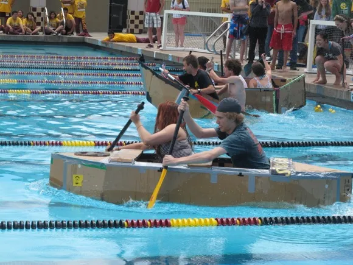
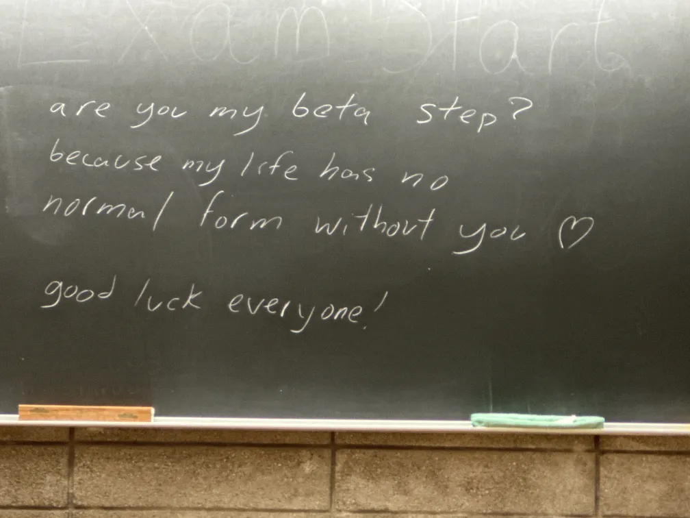

As my undergraduate education comes to a close, I wanted to look back on the teachers who have shaped my future. All these teachers have been amazing people, dedicated themselves to their students, and have expected nothing in return.

### [Jeff Decurtins](https://machronicle.com/m-a-physics-teacher-jeff-decurtins-discusses-his-teaching-career-and-upcoming-retirement/)

I came upon Mr. Decurtins under the most unusual circumstances. My highschool physics teacher got fired mid-year after some overblown consequences for some things he said. My school scrambled to replace our physics teacher without any notice. Mr. Decurtins swooped in out of retirement to teach my physics class. Because Mr. Decurtins came out of retirement, his teaching license was expired. Our class had to have a substitute teacher monitoring Mr. Decurtins until he could get his license renewed. 

Mr. Decurtins overflows with curiosity and has truly inspired me with his motto of instilling a *sense of wonder*. Each class started with a "sense of wonder" section where he would pull up a student submitted image. Mr. Decurtins would ask the class questions and try to explain the pictured phenomenon. I wish more teachers would motivate their classes and teach students to wonder.

Source: <a href="https://commons.wikimedia.org/wiki/File:Gl%C3%BChwendel_brennt_durch.jpg">Stefan Krause, Germany</a>, FAL, via Wikimedia Commons

Mr. Decurtins sometimes told stories. I'll do my best to share my favorite story.

> Let me tell you all a story back from when I was in college at the University of Oregon. I was working in my room one evening, and I looked out of the window. As the sun started coming through the window and was making a weird pattern on the floor of my dorm. I turned off the lights and started trying to find the angle from which the light was coming in from the window; but it wasn't making sense. I inspected the thickness of the glass to see if there was something causing the pattern. I kept trying to figure it out for a few hours. As the shadows grew longer through the evening, the light was still there on the floor. As the pattern was not growing dim, I realized the light was not coming from the window. The light was coming from the floor itself. I looked closely and saw a gap between the floorboards. The light was coming from beneath the floor. Well that's how I discovered my roommates had an illicit weed growing setup under my room.

Without a doubt, Mr. Decurtins is the most amazing teacher I have ever had. He put every ounce of energy he had into teaching the class. Mr. Decurtins had us do online homework assignments so that we could get feedback in real time. Online homework is much more common now, but I spent all of my schooling years submitting paper homeworks, handwriting essays, and printing out research papers. Mr. Decurtins was famous for responding to emails at any hour of the day, within minutes. His experiment-driven teaching style is the most fun I have ever had. He started the tradition of cardboard boat races in the physics class. At the end of the year, students make boats out of cardboard and duct tape, sit in them, and race them across the pool[^1].

Source: [InMenlo](https://inmenlo.com/2013/06/01/spotted-cardboard-boat-races-at-menlo-atherton/)

I still remember his hands-on labs, hilarious stories, and dedication to teaching. 

### [Joseph Pasquale](https://cseweb.ucsd.edu/~pasquale/)

> (Several months after the class)
> Me: I legitimately cannot stop thinking of CSE 120 and Pasquale
>
> Friend: Do you need help

Not a week goes by without me thinking of Professor Pasquale. I have dubbed Professor Pasquale as the "optimal professor." Professor Pasquale is a teaching professor, and it shows. I took his Operating Systems class. Professor Pasquale has knack for clearly presenting topics. It's abundantly clear that he has spent several decades fine tuning his Operating Systems class.

Professor Pasquale created his own teaching operating system that you develop with for the class. The great part is how he simulates real kernel development on the assignments. You write different modules of the Operating System for each assignment in C. Just like a real system, it's on you to thoroughly test your code, otherwise his autograder *will* find every issue and mark you down.

Professor Pasquale makes Operating Systems approachable for anyone. His diagrams and the manner in which he presents material makes even the most complicated seem obvious. He is a man of dry humor and is extremely responsive to students' message board questions. His course has changed the trajectory of my life. In another life, I would have loved to take his [slide rule](https://cseweb.ucsd.edu//~pasquale/Classes/SlideRule/) class.

In the words of my esteemed classmate Anonymous Atom on the course discussion board, "God is real, and his name is Professor Pasquale."

### [Glenn Tesler](https://mathweb.ucsd.edu/~gptesler/)

Professor Tesler is an amazing teacher. He is very intelligent at understanding student misunderstandings and correcting them. Professor Tesler's teaching is extremely precise—he starts and ends class exactly on time and always keeps the tempo of the course in sync. He does so much behind the scenes to make sure everything in the class ran smoothly, such as testing all technology before hand.

Professor Tesler brings life to Graph Theory. He has a shirt with the [Königsberg bridge](https://en.wikipedia.org/wiki/Seven_Bridges_of_K%C3%B6nigsberg) and does a neat demo in class by drawing a graph on a balloon and then flattening it.

### [Joe Politz](https://jpolitz.github.io/)

Joe is unbelievably kind and cares so much about teaching. He has changed the course of my life. Joe is among very few people who care about their students beyond the confines of the experience in his classroom.

He is a teaching professor and it shows. His classes are so polished, even though he was teaching the [compilers course](https://ucsd-compilers-s23.github.io/) in Rust for the first time. Joe "pole eats" Politz had some amazing assigments. His project writeups are so readable compared to other classes. As my friend hypothesizes, "he dreams of compilers and the programming assignment writeups are just dream logs." He puts so much effort into teaching. He treats his classes as his research projects and is constantly looking for ways to improve his course. 

## Honorable mentions:

### [Pat Pannuto](https://patpannuto.com/)

Perhaps the nicest human I have ever encountered. Pat is kind beyond belief. He is a self-described 'pushover'. Pat says yes to everything people ask of him, at a great cost to himself. I can certify that he is a real life superstar. Pat has helped me out so much, expecting nothing in return. He is so humble and refuses to acknowledge how amazing he is. 

### [Edward Kelting](https://ucsd.academia.edu/EdwardKelting)

The nicest human I have ever met. Professor Kelting puts his students first, even before his own life and his own marriage. It is crazy how much work Professor Kelting puts in his classes to know every student (among hundreds!) and give every student feedback. 

### So Many More
I am indebted to so many other amazing teachers whom I cannot hope to list.
Specifically, I would like to thank Mrs. Liane Strub, Mrs. Lisa Otsuka, Mr. Mike Dumbra, Mrs. Kristen Bryan, Mrs. Crystal Mcrae, Professor Gary Cottrell, and Professor Ruth Luo.

## Best TAs:

### James Ivey

Jamie might be the only person who cared among the required history classes I had to take. Despite getting abused by the department and having to deal with reading perhaps a thousand essays over the course of a quarter, he still read and gave timely feedback on every assignment. Jamie is so kind and cared about doing the right thing for the students, even if he wasn't being paid to do so.

### [CSE 123](https://cseweb.ucsd.edu/classes/wi23/cse123-a/) staff

Harsh Gondaliya, Calvin Lee, and Shreyas Ramaprasad saved me from one of the hardest classes I have taken. All three of these guys went leagues beyond what was required of them to help me and other students. These students collectively stayed after their office hours for several hours to help out every student. Shreyas held a special office hours to help me out when I couldn't attend his time slot due to a class scheduling conflict. Harsh is a human C compiler. I don't know how he does it. All these TAs were amazing and somehow held out despite the mob of students needing help.

### [Aidan Delinger](https://denlinger.dev/)

Aidan is an intellectual who really knows his stuff. He somehow made the esoteric philosophies of Haskell make sense.

## Best administrators:

### [Scott Rollans](https://www.youtube.com/watch?v=2Ud-OWijg5c)

Scott is the Math advising head. He is the most responsive administrator I have come across. He is probably the only administrator I have seen who goes beyond what his job requires to ensure students' issues are resolved.

### Amber Knight and Tina Chung

The CS department advisors are so efficient and helpful.

<!--
Only two among the dozens of profs I have had.
Dishonorable mentions:
Edmund Chang
Bryan Chin

These guys both have very kind demeanors. However, based on their actions, they do not have students' best interests at heart. Both professors implemented student hostile policies. Both had no visible interest in fixing student concerns.

I have been personally wronged by Edmund Chang.

Extra dishonorable mention:
<redacted> administration
Wronged me every time I interact with them.
-->

[^1]: It's so disappointing that I will never get to do this due to COVID.
