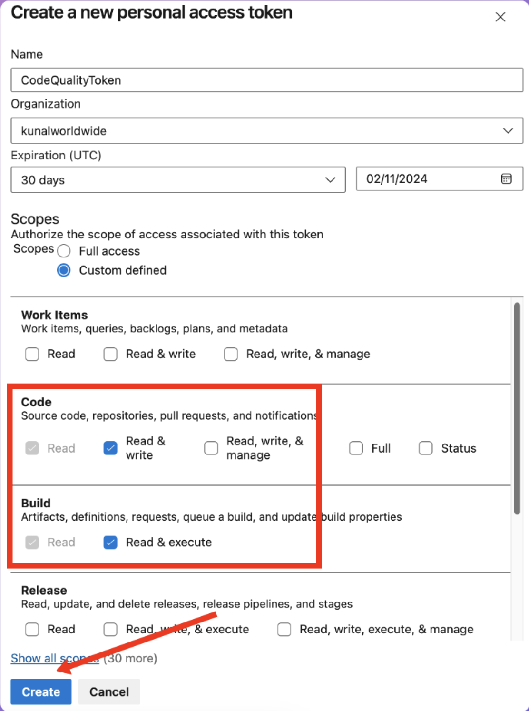
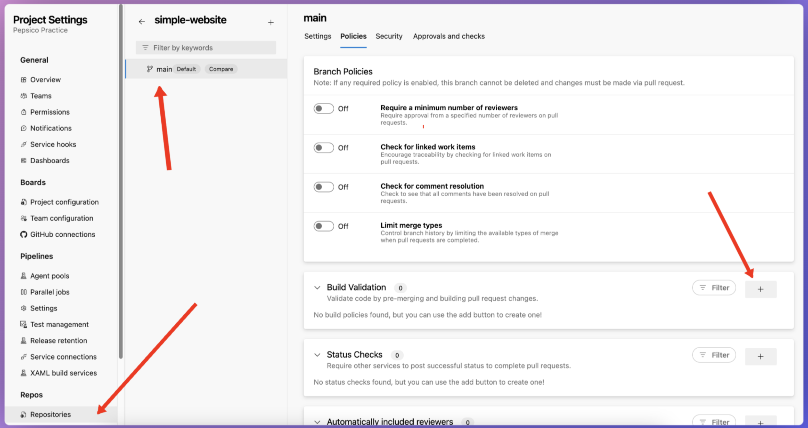
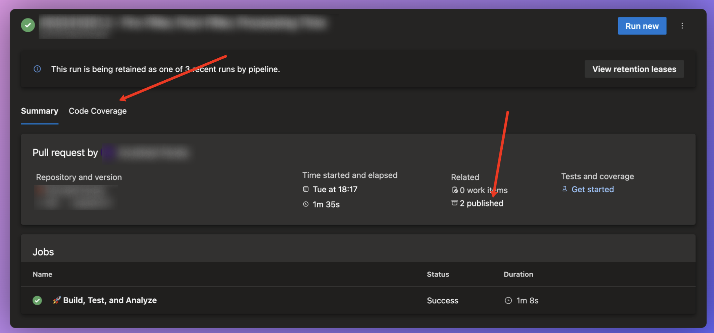
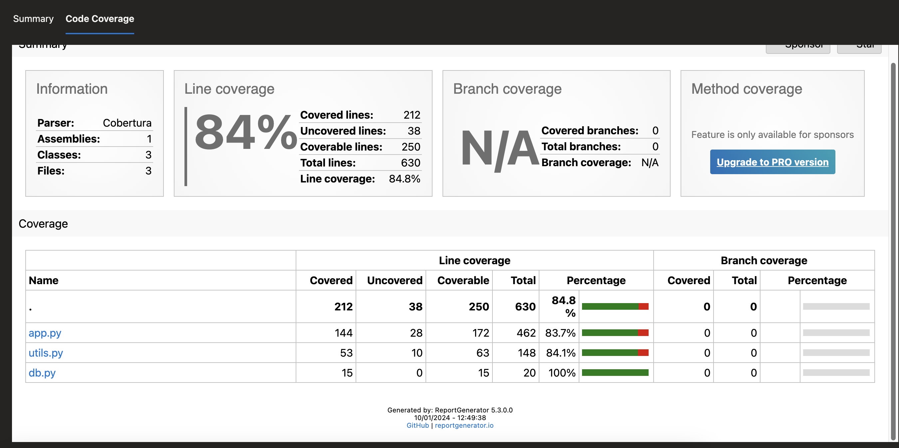

# Setting Up a Comprehensive Python Build Validation Pipeline in Azure DevOps

Hey there, 
Almost everyone who deploys python code wants to have it thoroughly checked and follow proper standards but sometimes setting up a code quality pipeline in your CI-CD process can be cumbersome due to various reasons.

Mainly,
1. You have to setup for each individual pipelines which can be an issue since many of us might have multiple repo multiple project and we need to have it standardize across projects to make sure it just works without tinkering in every other repo
2. There are plenty of tools and finding the right set of tools and also making sure a certain set of tools work together without giving any issues
3. Publishing a output also matters which will help the developers easily see what is lacking and they can start improving on the same.


Python developers and DevOps enthusiasts! Today, we're going to walk through setting up a robust build validation pipeline for your Python projects using Azure DevOps. This guide will help you ensure code quality, maintain consistency across multiple repositories, and streamline your development process - all without relying on external tools.

 
I was tasked not long ago to find a FREE solution without any external tool which should have below features

1. Must work with multiple repo.
2. Must provide meaningful output.
3. Should improve the overall Code Quality
4. Developers can run locally as well before publishing to the testing tool
5. All code in the main branch must follow the best in class industry standards

While I started developing the build validation pipeline ( Azure DevOps term basically means successful run of a pipeline to merge the pull request to a particular branch) I started looking for coding standards mainly for python I stumbled upon many articles and was in a bit of confusion which one to follow, but respecting the popularity and unanimous use of PEP-8 made the decision much easier.

Ref :https://peps.python.org/pep-0008/

Ok on top of a pep-8 validator I thought of adding isort which is another great tool to validate if your imports are correctly sorted and on top of this I added a few things extra like BLACK 
if we look at the black defination we see
```
"Black is the uncompromising Python code formatter. By using it, you agree to cede control over minutiae of hand-formatting. In return, Black gives you speed, determinism, and freedom from pycodestyle nagging about formatting. You will save time and mental energy for more important matters."
```

Ref : https://pypi.org/project/black/

So from code quality part I ended up using three tools or validators
1. Black (code formatter)
2. isort (import sorter)
3. Flake8 (linter)

I also added pytest and code coverage checks on this pipeline just to make sure developers are diligent to write unit test cases before they push the code to main branch


4. pytest (testing framework)
5. Code coverage analysis

`The steps here are for Azure Devops Pipeline but it can be easily replicated to githuba ctions or any other ci-cd tools with very minimal to minor tweaking
`

So let's look at the pipeline that I have been telling till now

## Step-by-Step Setup

### Step 1: Create the Azure Pipeline YAML File

First, create a file named `azure-pipelines.yml` in the root of your repository. This file will define our pipeline.

```yaml
trigger:
  - none

variables:
  - name: sourcePath
    value: 'sourcecode'
  - name: coverageThreshold
    value: 80
  - group: Tokens
  - name: CodeDirectory
    value: '$(System.DefaultWorkingDirectory)'

pool:
  vm../images/image: 'ubuntu-latest'

jobs:
- job: BuildTestAndAnalyze
  displayName: '🚀 Build, Test, and Analyze'
  steps:
  - task: UsePythonVersion@0
    inputs:
      versionSpec: '3.9'
    displayName: '🐍 Use Python 3.9'

  # More steps will be added here
```

This sets up the basic structure of our pipeline, specifying the Python version and defining some variables we'll use later.

```
Now if you see ths issue we need this build validation pipeline in multiple repositories which is a bit tricky since we all know if we add this yaml to a particular repo then it will only work on that and not any other repo instead I wanted it to be a seperate but clone the repo for which it get's triggered in the pull request.

The solution? 
look at he below step :)
```

### Step 2: Clone the PR Repository

Add this step to clone the PR repository:

```yaml
  - bash: |
      echo "🚀 Initiating repository clone process..."
      REPO_URL=$(System.PullRequest.SourceRepositoryURI)
      AUTH_URL=$(echo $REPO_URL | sed "s|cyncly-engineering@|$(Code_Read_PAT)@|")
      FULL_BRANCH=$(System.PullRequest.SourceBranch)
      BRANCH=$(echo $FULL_BRANCH | sed 's|^refs/heads/||')
      CLONE_DIR=$(System.DefaultWorkingDirectory)/cloned_repo
      
      git clone --branch "$BRANCH" "$AUTH_URL" "$CLONE_DIR"
      
      if [ $? -eq 0 ]; then
        echo "✅ Git clone successful"
        echo "##vso[task.setvariable variable=CodeDirectory]$CLONE_DIR"
      else
        echo "❌ Git clone failed"
        exit 1
      fi
    displayName: '🔄 Clone PR Repository'
```

This step clones the PR repository, allowing us to work with the latest code.

`this is a bit tricky spart and for other ci-cd tool we need to modify this the most`

### Step 3: Install Dependencies

Next, let's install the project dependencies and our code quality tools:

```yaml
  - script: |
      echo "🔧 Setting up Python environment..."
      python -m pip install --upgrade pip
      if [ -f $(sourcePath)/requirements.txt ]; then
        pip install -r $(sourcePath)/requirements.txt
      fi
    workingDirectory: $(CodeDirectory)
    displayName: '📦 Install Project Dependencies'

  - script: |
      echo "🛠️ Installing code quality and testing tools..."
      pip install black flake8 isort pytest pytest-cov httpx
    displayName: '🛠️ Install Code Quality and Testing Tools'
```

### Step 4: Run Code Quality Checks

Now, let's add steps to run our code quality checks:

```yaml
  - script: |
      echo "🖌️ Running Black formatter check..."
      black --check --line-length 79 $(sourcePath) 
    displayName: '🖌️ Run Black'
    workingDirectory: $(CodeDirectory)

  - script: |
      echo "🔀 Running isort import sorter check..."
      isort --check-only $(sourcePath)
    displayName: '🔀 Run isort'
    workingDirectory: $(CodeDirectory)

  - script: |
      echo "🔍 Running Flake8 linter..."
      flake8 $(sourcePath)
    displayName: '🔍 Run Flake8'
    workingDirectory: $(CodeDirectory)
```

These steps will check your code formatting, import sorting, and linting.

### Step 5: Run Tests and Generate Coverage Report

Add this step to run tests and generate a coverage report:

```yaml
  - script: |
      echo "🧪 Running unit tests and generating coverage report..."
      pytest --cov=$(sourcePath) --cov-report=xml --cov-report=html ./tests
    displayName: '🧪 Run Tests with pytest'
    workingDirectory: $(CodeDirectory)
```

### Step 6: Check Code Coverage Threshold

Let's ensure our code meets a minimum coverage threshold:

```yaml
  - script: |
      echo "📊 Checking code coverage threshold..."
      coverage_percentage=$(python -c "import xml.etree.ElementTree as ET; tree = ET.parse('coverage.xml'); root = tree.getroot(); print(float(root.attrib['line-rate']) * 100)")
      echo "Current code coverage: $coverage_percentage%"
      echo "Coverage threshold: $COVERAGE_THRESHOLD%"
      if (( $(echo "$coverage_percentage < $COVERAGE_THRESHOLD" | bc -l) )); then
        echo "❌ ##vso[task.logissue type=error]Code coverage ($coverage_percentage%) is below the threshold of $COVERAGE_THRESHOLD%"
        exit 1
      else
        echo "✅ Code coverage ($coverage_percentage%) meets or exceeds the threshold of $COVERAGE_THRESHOLD%"
      fi
    displayName: '📊 Check Code Coverage Threshold'
    workingDirectory: $(CodeDirectory)
    env:
      COVERAGE_THRESHOLD: $(coverageThreshold)
```

### Step 7: Publish Coverage Report

Finally, let's publish our coverage report:

```yaml
  - task: PublishCodeCoverageResults@1
    inputs:
      codeCoverageTool: 'cobertura'
      summaryFileLocation: '$(CodeDirectory)/coverage.xml'
      reportDirectory: '$(CodeDirectory)/htmlcov'
    displayName: '📈 Publish Coverage Report'

  - publish: $(CodeDirectory)/htmlcov
    artifact: CodeCoverageReport
    displayName: '📦 Publish Coverage Report as Artifact'
```

## Setting Up Local Development Environment

To ensure developers can run these checks locally, add the following instructions to your project's README:

### Prerequisites

- Python 3.9
- pip (Python package manager)

### Setting Up Your Environment

1. Clone the repository:
   ```
   git clone <repository-url>
   cd <repository-name>
   ```

2. Create a virtual environment:
   ```
   python -m venv venv
   source venv/bin/activate  # On Windows, use `venv\Scripts\activate`
   ```

3. Install dependencies:
   ```
   pip install -r sourcecode/requirements.txt
   pip install black flake8 isort pytest pytest-cov httpx
   ```

### Running Checks Locally

To ensure your code passes the pipeline checks, run these commands from the project root:

1. Black (code formatting):
   ```
   black --check --line-length 79 sourcecode
   ```

2. isort (import sorting):
   ```
   isort --check-only sourcecode
   ```

3. Flake8 (linting):
   ```
   flake8 sourcecode
   ```

4. pytest (unit tests and coverage):
   ```
   pytest --cov=sourcecode --cov-report=xml --cov-report=html ./tests
   ```

## Setting Up Pre-commit Hooks

To catch issues before they even make it to the pipeline, set up pre-commit hooks:

1. Install pre-commit:
   ```
   pip install pre-commit
   ```

2. Create a `.pre-commit-config.yaml` file in your project root:

   ```yaml
   repos:
   - repo: https://github.com/psf/black
     rev: 22.3.0
     hooks:
     - id: black
       args: [--line-length=79]
   - repo: https://github.com/PyCQA/isort
     rev: 5.10.1
     hooks:
     - id: isort
   - repo: https://github.com/PyCQA/flake8
     rev: 4.0.1
     hooks:
     - id: flake8
   ```

3. Install the hooks:
   ```
   pre-commit install
   ```

## Configuring isort

To ensure consistent import sorting that aligns with Black's formatting, create a file named `.isort.cfg` in the `sourcecode/` directory:

```ini
[settings]
profile = black
multi_line_output = 3
include_trailing_comma = True
force_grid_wrap = 0
use_parentheses = True
ensure_newline_before_comments = True
line_length = 79
```

ok Now how can we setup this pipeline to make sure any of our code get's scanned properly before it goes to the main branch?

First we need a PAT token to clone any repo across azure devops organisation so to get that first then set up the pipeline as a branch policy.

## Step 1: Create a Personal Access Token (PAT)

To clone repositories across your Azure DevOps organization, you'll need a PAT with appropriate permissions. Here's how to create one:

1. Sign in to your Azure DevOps organization (https://dev.azure.com/{your-organization}).
2. In the top right corner, click on your profile picture and select "Personal access tokens".
![alt text]../images/image.png)
3. Click on "New Token".
4. Give your token a name (e.g., "Build Validation Pipeline").
5. Set the organization to your Azure DevOps organization.
6. For expiration, choose an appropriate timeframe (e.g., 1 year).
7. Under "Scopes", select "Custom defined" and then check the following permissions:
   - Code (Read & Write)
   - Build (Read & Execute)
8. Click "Create".

9. Copy the generated token and store it securely. You won't be able to see it again.


## Step 2: Add the PAT as a Pipeline Variable

Now that you have a PAT, you need to add it as a variable in your pipeline:

1. In Azure DevOps, go to "Pipelines" > "Library".
2. Click on "+ Variable group".
3. Name the group (e.g., "BuildValidationTokens").
4. Add a new variable:
   - Name: `Code_Read_PAT`
   - Value: Paste your PAT here
5. Check the "Keep this value secret" box.
6. Click "Save".

## Step 3: Update Your Pipeline YAML

Update your `azure-pipelines.yml` to use the variable group:

```yaml
variables:
  - group: BuildValidationTokens
  # ... other variables ...

# ... rest of your pipeline configuration ...
```

## Step 4: Create a Branch Policy

To ensure this pipeline runs on all pull requests to your main branch:

1. Go to your Azure DevOps project.
2. Navigate to "Repos" > "Branches".
3. Find your main branch (often named `main` or `master`).
4. Click the ellipsis (...) next to the branch name and select "Branch policies".
5. Under "Build Validation", click "+ Add build policy".
6. Select your build validation pipeline.

7. Set "Trigger" to "Automatic".
8. Set "Policy requirement" to "Required".
9. Set "Build expiration" as per your preference (e.g., "Immediately").
10. Click "Save".

## Step 5: Configure Branch Protection

To prevent direct pushes to the main branch:

1. Still in the branch policies page for your main branch.
2. Under "Require a minimum number of reviewers", check the box.
3. Set the minimum number of reviewers (e.g., 1 or 2).
4. Optionally, check "Allow requestors to approve their own changes" based on your team's preferences.
5. Click "Save".

## Step 6: Update Repository Settings

Ensure your repository settings align with your new policy:

1. Go to "Project settings" > "Repositories".
2. Select your repository.
3. Under "Policies":
   - Check "Require a minimum number of reviewers".
   - Set "Minimum number of reviewers" (should match your branch policy).
   - Check "Check for linked work items".
   - Check "Check for comment resolution".
   - Optionally, check other policies as per your team's needs.
4. Click "Save".

## Step 7: Educate Your Team

Finally, make sure your team understands the new process:

1. Create documentation explaining the new pipeline and its checks.
2. Highlight the importance of running checks locally before creating a pull request.
3. Explain how to interpret and act on the pipeline results.
4. Encourage the use of pre-commit hooks for catching issues early.

By following these steps, you've now set up a robust system where:

1. All code changes must go through a pull request.
2. Each pull request automatically triggers your build validation pipeline.
3. The pipeline checks code formatting, linting, tests, and coverage.
4. Pull requests cannot be merged until the pipeline passes and required reviews are completed.

Now in the repo where you have added the build validation just try to merge the code into main branch
you will the build validation pipeline will be automatically added in queue and you can see the logs from the pipeline


After that if we go into the pipeline one step back there will be two important things


on top left there will be a tab called code coverage
upon clicking that you will be able to view line by line coverage report of each of the files


This setup ensures that all code going into your main branch meets your quality standards. Remember to periodically review and update your pipeline as your project evolves and new best practices emerge.


## Conclusion

By following these steps, you'll have a robust build validation pipeline that ensures code quality across your Python projects. This setup:

- Enforces consistent code style
- Catches potential bugs early
- Encourages comprehensive testing
- Provides clear feedback to developers

Remember, the key to success is continuous improvement. Don't hesitate to iterate on this pipeline as you learn what works best for your team and projects. Happy coding!

It takes lot of time to write up and share with comminity if you think this can benifit you do share the word