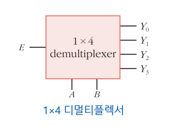
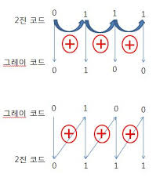

논리회로 07장
------

**목차**
01. 가산기
02. 비교기
03. 디코더
04. 인코더
05. 멀티플렉서
06. 디멀티플렉서
07. 코드 변환기
08. 패리티 발생기/검출기

-----
**1비트 비교기**
  
**2진 비교기**  

**우선 비교기란?**  
: 두 개의 이진수를 비교해서 어느 쪽이 큰지 알려주는 회로. 말 그대로 '비교하는 기계'

**1비트 비교기**
: 1자리 숫자만 비교함. 즉, 0과 1만 비교할 수 있음.

**2비트 비교기**  
: 2비트 이진수를 비교하기 위해 1비트 비교기를 여러 개 조합한 회로.  상위 비트(MSB)부터 비교하여 대소 관계를 판단한다.  
- 복습! MSB란
  - *M*ost *S*ignificant *B*it가장 왼쪽에 있는 비트. 즉, 가장 큰 값을 나타내는 비트
- 비교기에서 왜 MSB를 먼저 볼까?
  - 자리별 값은 왼쪽으로 갈수록 커짐. 가장 왼쪽 비트가 숫자 크기에 가장 큰 영향을 줌.
- 비교기에서 왜 MSB를 먼저 볼까?
  - 예를 들어
  A = 10 (2)  
  B = 01 (1)  
  라고 했을 때, MSB끼리 비교하면 A는 1, B는 0임. MSB를 봤을 때 이미 A>B이니까 결과를 바로 알 수 있음 -> 오른쪽 비트는 볼 필요 X

△2비트 비교기

**IC 7485**
: 4비트 크기 비교기 -> A와 B 중 어느 숫자가 더 큰지 비교해주는 칩

ex.  
A = 1010 (10)  
B = 0111 (7)  
이라면 $A>B$ 출력이 1, $A=B$ 출력이 0, $A<B$ 출력이 0이 된다.  

*특징 세 출력(A>B, A=B, A<B) 중 항상 하나만 1이 된다. 

-----
**03 디코더**
입력선에 나타나는 n비트의 2진 코드를 최대 2^n개의 서로 다른 정보로 바꿔주는 조합논리회로

1) Decoder : 작은 입력 -> 많은 출력
2) Encoder : 많은 입력 -> 작은 출력
3) 디멀티플렉서 : 입력 하나를 여러출력 중 한 곳으로 보내는 회로

1X2 디코더
- 1개의 입력에 따라서 2개의 출력 중 하나가 선택

*Decoder에서 Enable은 어떤 역할을 할까?  
: 디코더를 켤지 말지 결정하는 스위치 역할
- 왜 필요한가?
  - 만약 디코더가 여러 개 있다면 필요할 때만 하나를 켜야함
  - 디코더 A,B가 있다고 할 때 A,B가 동시에 동작하면 출력이 충돌 할 수 있음.
  - 그래서 E=1 -> 디코더 A 사용, E=0 -> 디코더 A 정지 처럼 사용

----
**04 인코더**

디코더는 숫자 -> 위치로 바꾸고  
인코더는 위치 -> 숫자로 바꾼다.  

즉, 둘은 서로 반대 역할을 함.  

----
**05 멀티 플렉서**

- 멀티 플렉서는 여러 개의 입력선들 중에서 하나를 선택하여 출력선에 연결하는 조합논리회로이다. 
  - 여러개의 입력 중 하나를 골라서 출력하는 선택기
  - *데이터 선택기*라고도 불림
    - 많은 입력들 중 하나를 선택하여 선택된 입력선의 2진 정보를 출력선에 넘겨주기 때문
  - 디멀티 플렉서는 정보를 한 선으로 받아서 2^n개의 가능한 출력선들 중 하나를 선택하여, 받은 정보를 전송하는 회로. 데이터 분배기라고도 함. 디멀티플렉서는 n개의 선택선의 값에 의해 하나의 출력선이 선택된다. 

--------
**06 디멀티플렉서**

- 멀티 플렉서와 디멀티 플렉서의 차이?
  - 여러 개의 입력 중 하나를 선택해 출력 -> 멀티 플렉서
  - 하나의 입력을 여러 출력 중 하나로 보냄 -> 디멀티 플렉서

E는 입력 데이터  
A와 B는 선택선(어느 출력으로 보낼지 결정)  
Y는 출력  

----------
**07 코드 변환기**

복습!  

