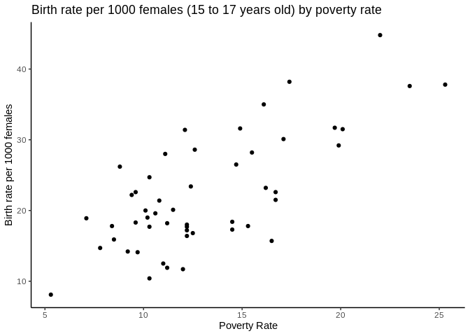

Simple liner regression model Yi - a + bXi + ei X: the independent
variable. We assume X is fixed Y: the dependenat variable, random e:
error term. We assume that ei are the independent and have the same
probability distribution normal (0, sigma^2)

The probablity distribution of Yi is Normal(a+bXi, sigma^2)

``` r
# require ggplot
require(ggplot2)
```

    ## Loading required package: ggplot2

``` r
# read the file 
data <- read.delim("~/Desktop/BINF8441_Course/poverty.txt")
head(data)
```

    ##     Location PovPct Brth15to17 Brth18to19 ViolCrime TeenBrth
    ## 1    Alabama   20.1       31.5       88.7      11.2     54.5
    ## 2     Alaska    7.1       18.9       73.7       9.1     39.5
    ## 3    Arizona   16.1       35.0      102.5      10.4     61.2
    ## 4   Arkansas   14.9       31.6      101.7      10.4     59.9
    ## 5 California   16.7       22.6       69.1      11.2     41.1
    ## 6   Colorado    8.8       26.2       79.1       5.8     47.0

``` r
summary(data)
```

    ##        Location      PovPct        Brth15to17      Brth18to19    
    ##  Alabama   : 1   Min.   : 5.30   Min.   : 8.10   Min.   : 39.00  
    ##  Alaska    : 1   1st Qu.:10.25   1st Qu.:17.25   1st Qu.: 58.30  
    ##  Arizona   : 1   Median :12.20   Median :20.00   Median : 69.40  
    ##  Arkansas  : 1   Mean   :13.12   Mean   :22.28   Mean   : 72.02  
    ##  California: 1   3rd Qu.:15.80   3rd Qu.:28.10   3rd Qu.: 87.95  
    ##  Colorado  : 1   Max.   :25.30   Max.   :44.80   Max.   :104.30  
    ##  (Other)   :45                                                   
    ##    ViolCrime         TeenBrth    
    ##  Min.   : 0.900   Min.   :20.00  
    ##  1st Qu.: 3.900   1st Qu.:33.90  
    ##  Median : 6.300   Median :39.50  
    ##  Mean   : 7.855   Mean   :42.24  
    ##  3rd Qu.: 9.450   3rd Qu.:52.60  
    ##  Max.   :65.000   Max.   :69.10  
    ## 

``` r
# y = year 2002 birth rate per 1000 females 15 to 17 years old and x = poverty rate, which is the percent of the state’s population living in households with incomes below the federally defined poverty level

# (1) scatter plot 
ggplot(data=data,aes(x=PovPct, y=Brth15to17))+
    geom_point()+
    theme_classic()+
    labs(title="Birth rate per 1000 females (15 to 17 years old) by poverty rate", x="Poverty Rate", y="Birth rate per 1000 females")
```



**we can see there is a positive relationship between poverty rate and
Birth rate per 1000 females (15 to 17 years old)**

1.  we can test there is a liner relationship of Y and X using lm
    function

``` r
x = data$PovPct
y = data$Brth15to17
result = lm(y~x)
summary(result)
```

    ## 
    ## Call:
    ## lm(formula = y ~ x)
    ## 
    ## Residuals:
    ##      Min       1Q   Median       3Q      Max 
    ## -11.2275  -3.6554  -0.0407   2.4972  10.5152 
    ## 
    ## Coefficients:
    ##             Estimate Std. Error t value Pr(>|t|)    
    ## (Intercept)   4.2673     2.5297   1.687    0.098 .  
    ## x             1.3733     0.1835   7.483 1.19e-09 ***
    ## ---
    ## Signif. codes:  0 '***' 0.001 '**' 0.01 '*' 0.05 '.' 0.1 ' ' 1
    ## 
    ## Residual standard error: 5.551 on 49 degrees of freedom
    ## Multiple R-squared:  0.5333, Adjusted R-squared:  0.5238 
    ## F-statistic:    56 on 1 and 49 DF,  p-value: 1.188e-09

**the result shows that the coeffient b(slope) is 1.3733 &gt;0 with a
significant level less than 0.05, which indicates that Y and X is
positively correlated**
