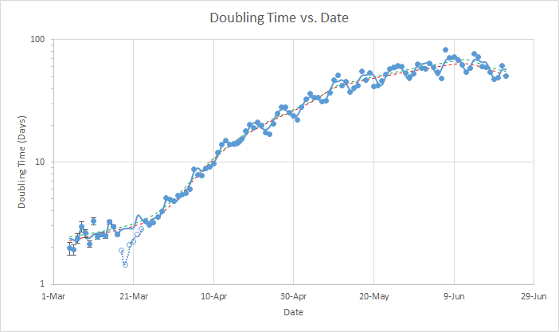

During 2020, my undergraduate research advisor, a colleague and I worked on an empirical model (classical/non-machine learning) for the case-doubling time of COVID-19.  We did this model-fitting using our [TRK statistic](https://github.com/nickk124/TRK) (a suite of “worst case uncertainty” Bayesian model-fitting algorithms), as it is especially useful for this type of two-dimensional dataset with uncertainty not just in the datapoints (error bars), but within the dataset as a whole (global variance). We used a smoothly-broken linear model (with 5 linear segments, each for different regimes of the virus’ spread) that also accounted for the variable weekly case-reporting cycle.

More information can be found [here](https://www.danreichart.com/covid19-reports).