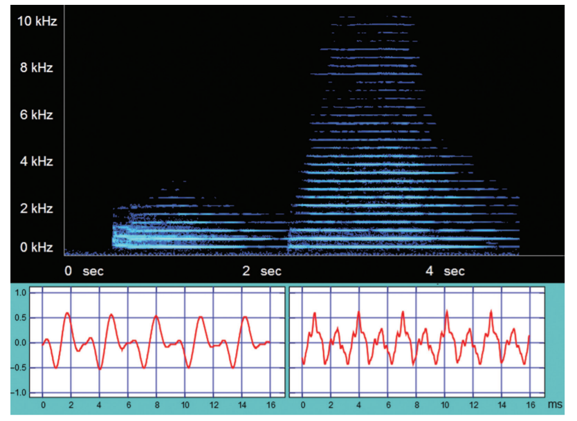

I’ve been playing the French horn since 2010, so when Physics professor [Dr. Mike Ruiz](https://mjtruiz.com/) of UNC Asheville asked if I wanted to write a paper with him about the physics of the horn, I immediately accepted. In this paper, we analyzed basic properties of sonic waves in the context of being played by the horn. We analyzed my playing with an oscilloscope, spectrograms, and Fourier spectra, and compared our results with theoretical predictions. The paper can be found [here](https://iopscience.iop.org/article/10.1088/1361-6552/aabbc1).