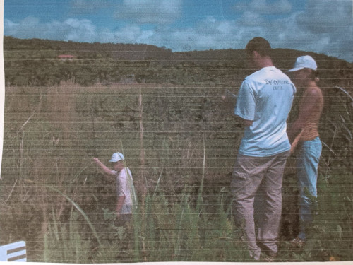

Synopsis: This project focused on assessing the water flow characteristics of the selected rivers to determine their suitability for providing a sustainable water supply to nearby small cities. Over a span of four years, comprehensive fieldwork was conducted, collecting data on width, depth, and current velocity at specific cross-sections. 

My responsibilities encompassed: (1) conducting field work to collect data, including measurements of width, depth, and current velocity at specific cross-sections using a current meter, (2) developing MATLAB scripts to calculate streamflow and to analyze the velocity profile using the collected data as input.

Outcomes: the establishment of a four-year database, which covers the duration of the project, containing information on the width, depth, and flow rates of the rivers, including their rating curves; (2) the assessment of water availability in the rivers, aiding in the evaluation of their sustainability as sources for public drinking water systems. 

Conferences:
<ul>
  <li>Metodologias para a estimativa da disponibilidade hı́drica em pequenas bacias hidrográficas sem dados. Estudo de caso: Bacia do rio Niquim-AL, II Simpósio de Recursos Hı́dricos do Sul-Sudeste. Rio de Janeiro, Brazil. 2008.</li>
  <li>Análise estatı́stica da velocidade média de um rio, 8° Congreso Iberoamericano de Ingenierı́a Mecánica. Cusco, Peru. 2007.</li>
  <li>Perfil de velocidade de um rio: Uma análise estatı́stica, XXX Congresso Nacional de Matemática Aplicada e Computacional. Florianópolis, Brazil. 2007.</li>
  <li>Correlação entre as velocidades médias na seção de medição de um rio, I Congresso de Engenharia, Ciência e Tecnologia. Maceió, Brazil. 2007.</li>
  <li>Águas superficiais da grande Maceió: Quantidade e qualidade, III Congresso Acadêmico da UFAL. Maceió, Brazil. 2006.</li>
  <li>Estudo de parâmetros fı́sicos das águas de alguns rios localizados na grande Maceió, VIII Simpósio de Recursos Hı́dricos do Nordeste. Gravatá, Brazil. 2006.</li>
  <li>Águas superficiais da grande Maceió: Quantidade e qualidade, II Congresso Acadêmico da UFAL. Maceió, Brazil. 2006.</li>
  <li>Monitoramento de alguns rios da grande Maceió/AL: Resultados preliminares, XVI Simpósio Brasileiro de Recursos Hı́dricos. João Pessoa, Brazil. 2005.</li>  
</ul>

<figure>
 <figcaption> The image captures a scene of field work, showing me standing in the river with a current meter in hand. </figcaption>
</figure>
