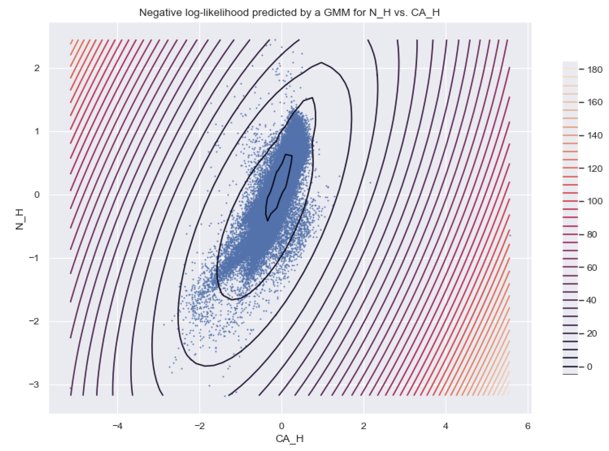

Another one of my early data science projects: for my ASTR 519 (Observational Astronomy) final class project, two classmates and I were tasked with using data mining techniques to glean meaningful information from a massive dataset (the SDSS Cannon) that has abundance data for a variety of chemicals, as well as astronomical position (and velocity) data for hundreds of thousands of stars. After cleaning and processing the raw dataset, we utilized various methods to try to find hidden relationships and correlations between the many variables of this high-dimensional dataset, including 1) [*k*-Means Clustering](https://en.wikipedia.org/wiki/K-means_clustering), 2) [Gaussian Mixture Models](https://scikit-learn.org/stable/modules/mixture.html), 3) [UMAP](https://umap-learn.readthedocs.io/en/latest/) and 4) [DBSCAN](https://en.wikipedia.org/wiki/DBSCAN). 

