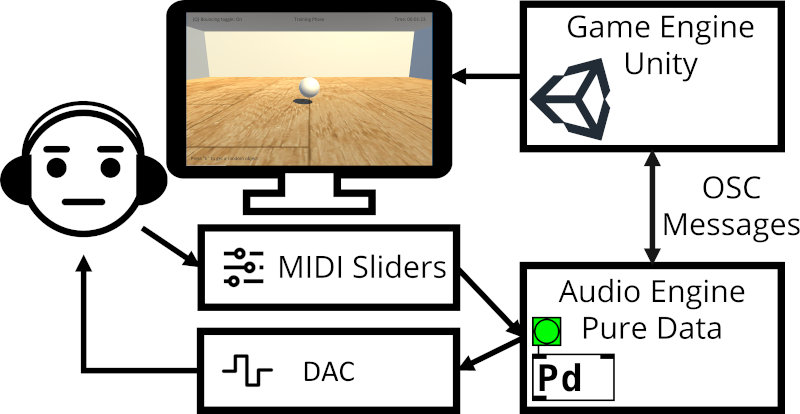

Physically-based sound synthesis can simulate virtual sound sources whose audio features reflect the physical characteristics of corresponding objects displayed in a virtual environment, allowing for real-time generation of content without relying on pre-existing audio samples. This, however, requires efficient control strategies for sound synthesis models that, depending on the nature of the sounding objects, require to be mapped to varying physical characteristics displayed through visual information. In this experiment, participants were asked to adjust a set of sound synthesis parameters based on varying physical characteristics of a virtual bouncing ball: distance, elasticity and radius. Statistical analysis of recorded subject responses shows that object radius influences evaluation of pitch and amplitude for the object's representation. Similarly, distance influences user evaluation of both reverb and amplitude whilst elasticity doesn't influence user evaluation of the feature distributions. This result is consistent across user groups evaluated: audio experts and naive listeners. Models are produced that encode these observations using linear regression, enabling automatic parameterisation of this feature space for audio synthesis engines.

[Full text here :)](https://www.researchgate.net/publication/354178279_Psychometric_Mapping_of_Audio_Features_to_Perceived_Physical_Characteristics_of_Virtual_Objects)

