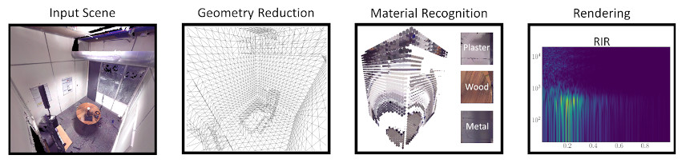

We present work in progress on a pipeline for audio rendering integrating vision-based systems for acoustic material classification. With a marching cubes algorithm, the pipeline estimates a cuboid acoustic volume encapsulating the listener, a sound source, and the surrounding environment. A variable-resolution binary field, samples and simplifies the input scene, and captures the appearance of surfaces to produce a set of image patches. A classifier infers acoustic materials, expressed as frequency-dependent acoustic absorption coefficients, from image patches. The estimated volume and aggregated acoustic materials provide input to the Image Source Model that models reverberation by generating Room Impulse Responses (RIRs). We conduct preliminary tests by applying our pipeline on a set of indoor and outdoor scenes, producing RIRs with inferred acoustic materials, comparing them against RIRs with manually assigned acoustic materials, extracting and evaluating objective metrics, such as reverberation or clarity. Through a learned metric on subjective responses, we compare perceptual aspects of automatically-generated RIRs against those manually tagged. Objective and subjective analysis suggests that the pipeline can automate the acoustic material classification process by producing RIRs indistinguishable from manually-tagged counterparts.

[Access paper here](https://www.researchgate.net/publication/354661690_Vision-based_Acoustic_Information_Retrieval_for_Interactive_Sound_Rendering)

