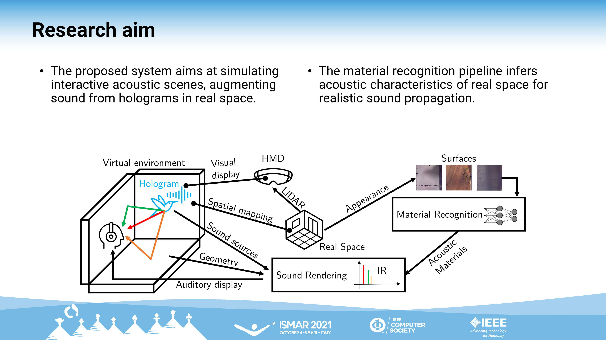

The planned thesis work involves adopting computer vision techniques in the process of decomposing complex scenes to recognise acoustic characteristics of space, determining physical and structural features of complex scenes. The experiments presented demonstrate applications of scene understanding techniques to game scenes and virtual reconstructions of real space to determine acoustic properties of scene geometry for automating realistic sound rendering, identifying the current state of automatic acoustic material recognition for virtual environments and proposing a novel evaluation framework to test objective and subjective accuracy against measurements from real environments. Proof-of-concept systems have been tested on state-of-the-art acoustic renderers to demonstrate their efficiency in offline procedures. Current directions are aimed at designing end-to-end pipelines for interactive, real-time applications, with the ambition of adopting computer vision to understand the acoustic space, even in contexts of dynamic geometry typical of Augmented Reality platforms, where the acoustic space is constantly updating based on the surrounding, real world.

[Access paper here](https://www.researchgate.net/publication/354661690_Vision-based_Acoustic_Information_Retrieval_for_Interactive_Sound_Rendering)

