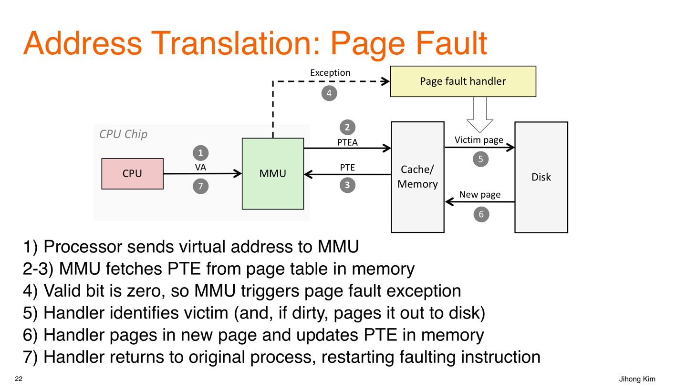
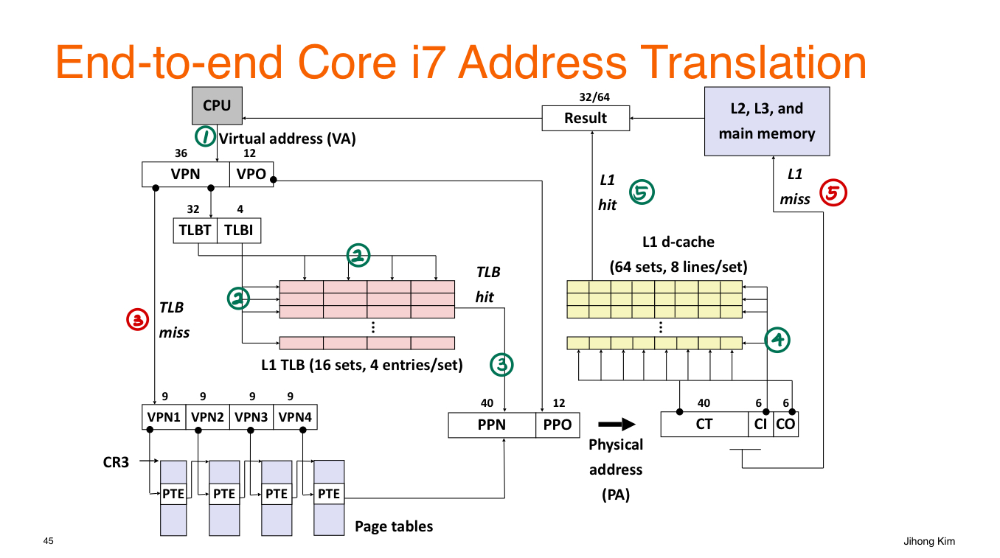
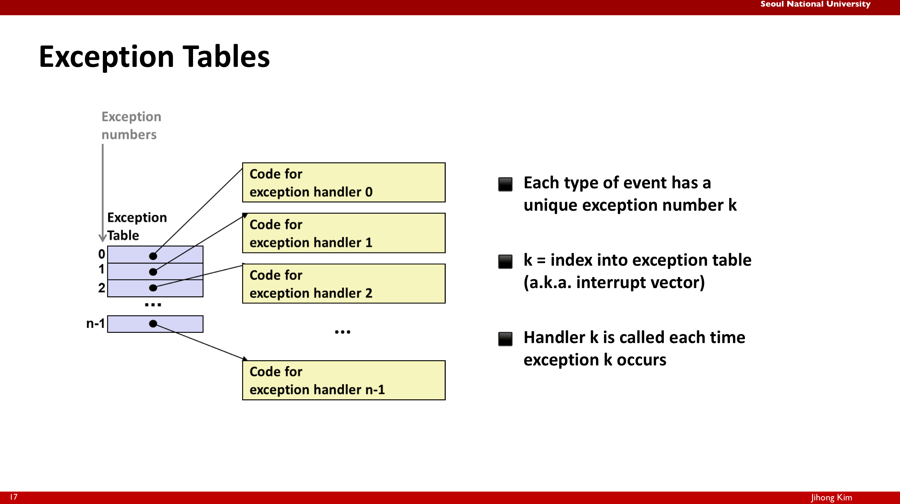
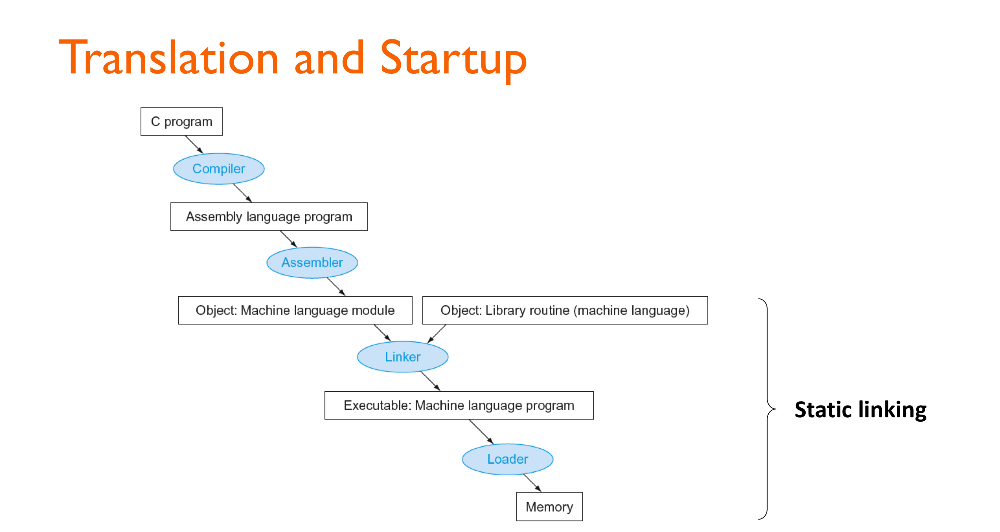

In this post, overral concepts of cache, pipelining and ISA is introuduced. 

# To begin
지난학기 Logic Design, 이번학기 Computer Architecure 강의를 수강하며 추상적이었던 컴퓨터의 동작 방식에 대한 이해가 높아졌다. 총 4편의 글을 통해 두 학기 동안 배운 내용을 정리하고자 한다. 배울 때는 Logic Design에서 가장 밑바닥인 트랜지스터의 구성부터 Computer Architecure 수업에서 ISA, Pipelining, Cache의 순서로 배웠다면 정리를 하는 입장에서는 그 역순으로 가장 큰 그림부터 가장 세부적인 그림까지 보는 방식으로 하여 이해를 높이고자 한다. 01 에서는 Cache-Pipelining-ISA의 순서로 CPU가 어떻게 동작하는지를 알아볼 것이다. 02에서는 BSV라는 언어로 해당 개념들을 어떻게 구현했는지 lab 과제 중심으로 알아볼 것이다. 03에서는 modern cpu의 구조에 알아본다. 04 에서는 Logic Design에서 배운 회로의 개념을 더한다. 

❗이 글에서는 RISC-V 32 bit architecure를 중심으로 글을 전개한다. 32 bit 이라고 할때 무엇이 32인지 헷갈릴 수 있다. 레지스터의 개수인가? 명령어의 길이인가? 레지스터가 저장하는 비트 수인가? 정답은 마지막이다. 하나의 레지스터가 저장하는 비트수가 32 bit인 것이다.

이 글의 내용을 통해, 컴퓨터가 CPU가 메모리의 명령어를 어떻게 순차적으로 수행하며 그 과정에서 어떤 최적화 기법들을 이용하는지, 컴퓨터 구조에서 하드웨어의 책임과 소프트웨어의 책임은 어디까지인지인지에 대한 이해를 쌓을 수 있다. 

# Cache - Virtual Address
IF-ID-EX-MEM-WB 5단계로 동작하는 파이프라인 구조를 생각하자. 이때 메모리에 접근이 필요한 단계는 언제인가? 우선 IF 단계에서 다음 명령어의 주소를 fetch하기 위해 메모리에 접근해야 한다. 또, MEM 단계에서 Store나, Load 명령어를 수행할 때 메모리에 접근하게 된다. CPU는 컴파일러가 만들어준 명령어를 차례로 수행하는데 아래 그림은 명령어의 수행 과정 중, 메모리 접근이 필요한 IF 단계와 MEM 단계에서 가상 주소를 물리 주소로 변환하는 과정을 나타낸 그림이다. 예를 들어, **IF 단계에서 CPU는 pc register에 있는 값에 있는 가상 주소의 값을 물리 주소로 변환하여 해당 물리 주소의 위치에서 명령어를 fetch 해오게 된다**. 

❗IF 단계와 MEM 단계에서 CPU는 메모리 접근이 필요할 때 그때마다 가상 주소를 물리주소로 변환한다. MMU는 CPU의 구성 요소로서 가상 메모리 시스템에서 CPU가 사용하는 가상 주소(Virtual Address)를 실제 물리 주소(Physical Address)로 변환해주는 하드웨어 장치이다.

// ❗**컴파일러나 어셈블러가 만들어내는 `st`, `ld`, `mov` 등의 명령어에 포함된 주소는 "가상 주소"가 아니다.**
좀 더 정확히 말하면, **"가상 주소가 될 수 있는 상대적 정보(오프셋)"를 담고 있을 뿐이다.** **진짜 가상 주소는 OS가 실행 시점에 정해준다.** 어쨌든 cpu가 명령어를 하나씩 읽어오는 시점에서는 가상주소정보를 읽어오는 것이다.

❗**프로그램이 실행될 때 OS가 가상주소 공간을 할당한다. OS는 첫 명령어의 가상 주소 (entry point)를 정한다. CPU는 이 가상주소를 PC에 넣는다. MMU가 이 가상주소를 물리주소로 변환한다. 이후 명령어 fetch가 진행된다.** 

🔵 **명령어 생성(컴파일러)**

지금까지의 논의에서 다음과 같은 질문이 생길 수 있다. 

1. IF-ID-EX-MEM-WB 각 단계가 무엇을 의미하는가?
2. Store, Load 등 명령어가 무엇인가
3. 가상 주소를 사용하는 이유는 무엇인가?
    1번 질문에 대한 답은 글의 중반부 Pipelining에서 얻을 수 있다. 2번 질문에 대한 답은 글의 후반부 ISA에서 얻을 수 있다. 우선 3번 질문 가상 주소를 사용하는 이유에 대해 알아보자.
    프로그램이 물리주소를 직접적으로 이용하여 메모리에 접근한다면 크게 두 가지 문제점이 생길 수 있다. 우선 만약, Physical Memory의 크기를 벗어나는 프로그램을 작성하게 되면 문제가 생긴다. 예를들어, 어떤 컴퓨터가 4MB의 물리 메모리 시스템을 가지고 있는데 프로그램이 8MB의 메모리 요구량을 가진다면? 이 프로그램은 돌아가지 않을 것이다. 또한, 프로그램은 돌아가는 컴퓨터의 환경에 따라 돌아갈수도 돌아가지 않을 수도 있을 것이다. 다음으로, 여러 개의 프로그램 A, B, C가 같이 수행되는 경우 물리주소를 나눠서 프로그램별로 할당해야 한다. 이때 프로그램 D를 추가로 작성하려고 하면 메모리 할당을 새롭게 해야한다. 

이제 가상 주소를 물리주소로 바꾸는 과정을 자세히 알아보자. 

위 그림을 기준으로 설명하면,

1. CPU가 변환해야 할 48 bits의 가상 주소 (예를 들어, IF 단계에서 PC+4) 정보를 제공
   - 상위 36 bits는 VPN 으로 해당 가상 주소가 속한 page number를 나타내고
   - 하위 12 bits는 VPO 으로 해당 page 내에서 가상 주소의 위치를 나타내는 오프셋 역할을 한다.
2. VPN으로 TLB에서 해당하는 VPN 이 있는지 확인한다. **TLB는 MMU에 존재하는 고속 캐시로 PTE가 존재하는 L1 cache 영역보다 빠르게 접근이 가능하다.**
   - VPN의 하위 4 bits로 TLB에서 해당하는 set을 찾고
   - 상위 32 bits tag가 해당하는 set의 4개의 entry 중 하나에 존재하고 Valid = 1인지를 확인한다. 그렇다면 해당 entry에서 PPN을 읽고, 그렇지 않다면 TLB Miss가 발생한 것이다. 
   - 위 그림과 같은 경우를 16 sets, 4-**way associative** 라고 한다. 
   - TLB의 각 entry에서는 다음의 정보를 저장한다.
     - Tag : 32 bits VPN을 의미한다.
     - PPN : VPN에 대응하는 실제 물리 페이지 번호를 의미한다. 
     - Valid : 해당 TLB entry의 정보가 현재 유효한지를 나타낸다. TLB Miss가 발생하면, 페이지 테이블에서 정보를 조회한 후, TLB에 새로운 entry를 저장할 때 Valid를 1로 한다. **(Q : 이 과정이 모두 If 단계에서 일어나는가?)** 따라서, 처음 접근되는 페이지는 TLB Miss가 발생할 수 밖에 없다. 
     - Dirty :  TLB 혹은 페이지 테이블에 있는 VP들은 모두 대응하는 물리 메모리의 공간을 차지하고 있다. 운영체제가 **페이지를 물리 메모리에서 디스크로 쫓아낼(evict) 때**, 해당 페이지가 **수정된 적이 있다면 (dirty = 1)** **디스크에 다시 써줘야 한다. (write-back)** TLB miss가 나면 → 페이지 테이블에서 dirty 값을 확인하고, TLB에 로딩할 때 dirty 값도 함께 가져온다.
     - Ref : LRU를 구현하기 위한 비트. LRU (Least Recently Used)는 가장 오랫동안 사용되지 않은 데이터를 가장 먼저 제거하는 캐시 교체 알고리즘이다. TLB Miss가 발생하면, 페이지 테이블에서 정보를 조회한 후, TLB에 새로운 entry를 저장해야 하는데, 이 때 기존 4개의 entry 중 무엇을 제거할 것인지에 대한 기준이 필요하다. Ref = 1 이라는 것은 특정 인터벌 안에서 해당 페이지가 접근 되었음을 의미한다.

# Cache

To be continue...

# Exception

밑에 다룰 ISA의 내용만으로는 

- `Jumps and branches`: 조건문이나 루프에서 쓰이는 점프/분기
- `Call and return`: 함수 호출 및 복귀

위 두 메커니즘을 이용해 **program state (프로그램 상태)**의 변화에만 반응할 수 있다. 즉, **내부 로직 흐름에 대한 제어**만 가능하다. 하지만 현실적인 시스템은 외부 환경, 하드웨어, 사용자의 예기치 못한 행동 등으로 인해 **system state (시스템 상태)**가 변하는데, 기존 방식은 이런 상황을 다루기 어렵다. 

+ **디스크나 네트워크 어댑터에서 데이터 도착**

- **명령어 실행 중 0으로 나누기 발생**

- **사용자가 키보드에서 Ctrl+C 입력**

- **시스템 타이머 만료**

따라서, **Exceptional Control Flow** 가 필요하다. **Excpetional Control Flow** 란, 컴퓨터 시스템의 모든 **계층(Layer)**에서 존재하는 제어 흐름 변경 방식을 말한다.  계층에는 **하드웨어 레벨**, **운영체제 레벨**, **런타임 라이브러리 레벨**, **응용프로그램 레벨** 이 있다. 

Low-level 에서는 **Exception**을 처리하는 방식으로 제어가 이루어진다. **Exception**이란, 시스템 이벤트에 반응해 제어 흐름이 변경되는 것을 의미한다.(An **Excpetion** is a transfer of control to the OS Kernel in response to some event) 하드웨어와 OS software의 조합으로 동작한다. 예를 들어, **Divide by 0 Exception**이 발생하는 경우를 생각해보자.

1. 유저 프로그램 실행 중
   - CPU가 DIV 명령어를 해석하다가 0으로 나누는 상황을 감지
   - 이 시점에서 하드웨어 수준 **Divide by 0 Exception** 이 발생
2. CPU 내부 동작 (하드웨어 제공)
   - 현재 실행 상태(Reg, PC 등)을 스택/특정 메모리에 저장
   - 특정 예외 벡터 주소르 PC를 변경
     - 이 예외 벡터 주소에는 OS 커널의 예외처리 루틴 코드의 시작 위치가 들어 있음
3. OS 커널 코드 실행 (소프트웨어 영역)
   - 커널의 예외 처리 루틴(메모리에 존재) 에서 상황 분석
   - 적절한 대응(프로세스 종료, 페이지 로드, 시그널 전달 등) 수행
   - 필요한 경우 다시 원래 프로그램의 다음 명령어로 복귀
4. 복귀 또는 종료
   - 복귀 시 저장된 Reg, PC를 복원
   - 종료 시 해당 프로세스 자원 해제

Exception 마다 해당하는 번호가 있다. 예를들어 **Divide by 0** 의 Exception Number을 0이라고 하면 CPU가 해당 예외를 감지했을 때, Exception Table의 0번 entry를 방문한다. 여기에는 해당 예외에 대한 예외 처리 루틴 주소가 매핑되어 있다. 

❗Pipleline이 20단계라고 가정했을 때, 10단계 진행중인 instruction에서 Exception이 발생하면, 11~20 단계의 instruction은 수행을 마치도록 보장해주어야 한다.

❗실행되어야 할 instruciton 순서가 1->2->3->4 일 때 실제 Pipeline에서는 in order로 1->2->3->4 수행되지 않는다. 최적화를 위해 3->4->1->2 처럼 out of order로 수행되는데 이 때, 1에서 exception이 발생하면 3, 4를 수행하기 전으로 복원해야 하는데, 이 overhead가 크므로 커밋 (머신 상태를 바꾸는 일) 은 out of order로 수행하지 않는다. 중간 수행은 out of order로 해도 마지막 커밋은 in order로 한다.  

ECF의 Higher-level 메커니즘에는 다음이 있다.

- **Process Context Switch** 
  - 여러 프로세스를 번갈아 실행하기 위해, 현재 실행 중인 프로세스 상태를 저장하고 다른 프로세스 상태로 교체하는 과정
  - 하드웨어 타이머 + OS software 로구현됨
- **Signals**
  - 실행 중인 프로세스에 비동기 이벤트를 알리는 메커니즘
  - Ex : SIGINT (Ctrl+C), SIGKILL
  - OS software로 구현됨
- **Nonlocal Jumps (setjmp() / longjmp() in C) **
  - C 런타임 라이브러리에서 제공하ㅏ는 기능으로, 함수 호추 ㄹ스택을 건너뛰고 특정 지점으로 바로 점프 가능
  - 예외 처리나 긴급 복구 상황에서 사용

Exception에는 **Asynchronous Exception (Interrput)** 과 **Synchronous Exception**이 존재한다.

1. **Asynchronous Exception (Interrupt)**

   - CPU 외부에서 발생한 사건에 의해 발생하는 예외를 의미한다. 즉, 현재 CPU가 실행 중인 명령어와 직접적인 연관이 없다.
   - 외부 장치에서 CPU의 interrupt pin에 신호를 전달하여 exception을 알린다.
   - 처리 흐름
     - 외부 장치 (타이머, 키보드, 디스크 등) 에서 이벤트 발생
     - CPU의 interrupt pin 활성화
     - CPU가 현재 명령어를 끝낸 후 커널의 interrupt handler로 제어 이동 (현재 명령어를 끝낸다는 것은 pipeline 안에 존재하는 모든 명령어의 수행을 완료한다는 것이다. 그동안은 새로운 명령어를 fetch 하지 않는다.)
     - 처리 후 next 명령어로 복귀
   - 예시
     - **Timer interrupt** : 몇 ms 마다, 타이머 칩이 interrupt를 발생시켜 OS가 CPU 제어권을 가져옴. 스케쥴링, 프로세스 전환 등에 사용
     - **I/O interrupt** : Ctrl+c 키 입력, 네트워크 패킷 도착, 디스크 데이터 읽기 완료

2. **Synchronous Exception**

   - CPU가 현재 실행 중인 명령어 수행 과정에서 발생하는 예외를 의미한다. 명령어와 직접적인 관련이 있다.

   - **Traps** : 의도적으로 발생시키는 Exceptions로 **system calls**, **breakpoint traps**, **special instructions** 가 있다.

     - interrupt와 동일하게 exception을 일으킨 명령어를 비롯해 파이프라인에 들어있는 현재 명령어를 모두 실행 후, 커널 진입. 이후 next 명렁어로 북귀.

     - **System Call** : 유저 모드에서 커널 모드로 진입하기 위한 공식적인 인터페이스. 유저 프로그램은 하드웨어(디스크, 네트워크, 화면 등)에 직접 접근할 수 없고 OS를 통해서만 접근 가능하다. System Call 실행절차는 아래와 같다.

       1. 프로그램이 라이브러리 함수를 호출 (printf, read, write 등)
       2. 라이브러리 함수 내부에서 trap 명렁어 실행
       3. trap이 CPU를 커널 모드로 전환 -> 시스템 콜 번호를 보고 해당 커널 함수 실행
       4. 결과를 유저 모드로 반환

     - **printf("hi")** 시 trap 발생 과정

       1. printf("hi") 호출 -> C 표준 라이브러리의 printf 함수 실행

          (컴파일러가 메모리에 있는 C 표준 라이브러리 printf 함수로 jump 하도록 컴파일 함)

       2. printf 내부에서 문자열 포맷 처리 후, 최종적으로 **write** 시스템 콜 호출. Ex. write(1, "hi", 2)

          (메모리에 있는 printf 함수는 내부적으로 write라는 시스템 콜 함수를 호출, 이 write 함수도 메모리에 존재)

       3. write 시스템 콜 함수는 내부적으로 trap 명령어 (RISC-V ISA 기준 **ecall**)를 실행

          (write함수는 우리가 원하는 프린트 동작 중 일부를 하도록 메모리에 작성되어 있음. sys_write 시스템 콜 번호 등을 레지스터에 로드. 다만 하드웨어에 접근한다는 의미에서 ecall 명령어 마지막에 사용)

       4. trap 명령어 실행 시, CPU에서는 현재 Reg, PC를 저장하고 커널로 전환한다. 예외 번호를 보고 exception table에서 sys_write 핸들러 주소를 로드한다.

       5. 커널 모드에서 sys_write 함수가 실행 후, trap에서 복귀하여 유저모드로 돌아와 printf 이후 코드를 계속 실행한다.

     - **breakpoint** : 디버깅 중 프로그램 실행을 특정 지점에서 멈추게 하는 기능이다. 멈추고자 하는 지점의 명령어를 저장해두고 그 자리에 특수 trap 명령어로 바꿔치기한다. 실행이 trap에 도달하면 디버거가 제어권을 얻어 변수 값 확인, 메모리 상태 조사 등을 할 수 있다.

   - **Faults** : 의도적이지 않지만 복구가 가능할 수도 있는 exception이다. 

     - Ex : **page fault** (복구 가능), **protection fault** (복구 불가능), **floating point exceptions**
     - 커널이 처리 후, 현재 명령어를 재실행하거나 프로그램 종료

   - **Aborts** : 의도적이지 않고 복구가 불가능하다.

     - Ex : illegal instruction, parity error, machine check
     - 즉시 프로그램을 종료한다.

   Fault나 Abort의 경우 Interrupt와 Trap과 다르게, CPU가 예외가 발생한 즉시, 예외 발생 지점 이후 파이프라인 안의 명령어들을 모두 flush 하고 예외 핸들러로 점프한다. 예외 발생 지점 이전 파이프라인 안의 명령어들은 모두 수행이 완료되고 예외 핸들러로 점프한다.(밑에서 설명할 Precise Exception일 경우에만 그렇다.) Fault의 경우, 복귀를 하게 되면 해당 명령어를 다시 fetch 해 실행한다. 

RISC-V 에서, 예외 발생 시, 하드웨어가 처리하는 기본 절차는 다음과 같다.

- Save PC of offending instruction
  - **SEPC** Reg에 예외를 발생시킨 명령어의 PC 값을 저장. Fault의 경우, 예외 처리 후 그 명령어를 다시 실행해야 하므로, 저장해야 한다. Trap은 보통 다음 명령어로 돌아가지만, 그래도 현재 PC 값을 저장.
- Save indiciation of the problem
  - **SCAUSE** Reg에 예외의 원인(코드)을 저장. 이 값은 OS 커널이 예외 처리 루틴에서 참조해 무슨 예외인지를 구분하는 데 사용
- Jump to handler
  - 커널의 예외 처리 루틴 시작 코드로 jump

파이프라인은 여러 명령어를 동시에 수행하므로, 동시에 여러개의 예외가 발생할 수 있다. 이 예외를 처리하는 방법에는 **Precise Exception**과, **Imprecise Exception**이 있다. 

- **Precise Exception** : 예외가 발생했을 때, 해당 명령어 이전까지의 명령어는 모두 정상적으로 완료되고 해당 명령어 이후의 명령어는 전부 flush 된 상태로 CPU 제어가 예외 처리기로 넘어가는 것.
  - 가장 먼저 발생한 명령어의 예외를 우선 처리
  - 그 이후 단계에 있는 명령어는 모두 flush
  - 예외가 발생한 명령어 주소와 원인을 SPEC, SCAUSE에 저장
  - OS 예외 처리기로 점프
  - Instruction이 4->3->2->1 순으로 out-of-order로 수행되는데 2에서 exception이 발생하면 1번의 commit이 정상적으로 끝나고 나서 수행.
- **Imprecise Exception** : 하드웨어에서 예외를 정렬하지 않고, 그 시점의 파이프라인 상태를 그대로 저장한 뒤, 소프트웨어가 어떤 명령어가 실패했는지 직접 찾아서 처리하게 하는 방식
  - 하드웨어 구현이 단순해지지만, 소프트웨어 예외 처리기가 더 복잡해짐.
  - 복잡한 다중 out-of-order 파이프라인에서는 정확한 예외 순서를 복구하기가 어려워 현대 고성능 CPU 대부분 precise exception을 유지하려고 노력함.

# Pipeline and Solving Hazard

To be continue...

# Translating and Starting a Program

우리가 프로그램을 Compile 하면 Assembly를 만들어내고 Assembler를 불러서 Object 파일을 만들어낸다. 여러 개의 c파일 a.c, b.c 등의 파일에서 Object 파일을 만들어내고 이들을 하나의 Binary로 만드는 것이 Linker이다. 그렇게 만들어진 것이 Executable 인데, 이 파일을 실제 실행하려면 메모리에 옮겨져야 하는데, 이 일을 하는 것이 Loader 이다. Executable 안에 있는 instruction이 뭐가 있고 data가 뭐가 있는지 정해진 약속에 따라서 정해진 위치에 load 한 다음에 맨 처음 address로 start.

- **Object file**
  - 오브젝트 파일은 거의 실행 가능한 코드이지만, 아직 모든 주소나 외부 참조가 완전히 해결된 상태가 아니다. 
  - 오브젝트 파일 안에는 이미 기계어 명령과 데이터가 들어 있다. 하지만 다른 파일의 코드와 **link** 되지 않은 상태이다. 예를 들어, main.c에서 foo() 를 호출했지만 foo() 가 util.c 에 구현되어 있다면, 현재 단계에서는 foo 의 실제 주소를 모른다. 
  - 한 파일에서 정의한 함수/변수를 다른 파일에서 사용하려면 **symbol** 연결이 필요하다. 오브젝트 파일에는 '이 이름의 함수나 변수를 호출/참조해야 함' 이라는 외부 참조 표기만 있고, 실제 주소는 나중에 링커가 채운다.
  - 오브젝트 파일은 실행파일을 만들기 위해 필요한 부가 정보를 함께 가지고 있다.
    - **Header** : 오브젝트 파일의 전반적인 구조와 크기 등 메타데이터.
    - **Text segment** : 실제 기계어 코드 (명령어) 가 들어 있는 영역. 
    - **Static data segment** : 전역 변수, static 변수 등을 저장. 
    - **Relocation info** : 아직 확정되지 않은 주소나 참조에 대한 정보
    - **Symbol table** : 현재 파일 안에서 정의된 심볼(함수, 전역변수)과 외부에서 가져와야 하는 심볼 목록.
    - **Debug info** : 소스 코드와 기계어를 연결하는 디버깅 정보.
- **Linker**
  - 0410 : 56분 부터 듣기.

# ISA

To be continue...

🔵 **명령어 생성(컴파일러)** **→**

// overal / BSV / logic design / modern cpu
지난하

// 레지스터에 저장된 주소는 가상주소
// pc는 32개 레지스터 외 별도의 추가 레지스터.
// 시스템에 따라 다르다 / 컴파일러에 따라 다르다 / 프로세서(=cpu)에 따르 다르다 의미

// loading/linking/compiling

// 컴파일러는 어떤 하드웨어인가 그끝은 무엇인가(펀치기계)

// 프로그램 여러개가 실행될때 가상주소-물리주소를 누가/어떻게 관리하는가

// L1 cache(Dram) - L2 cache - disk
