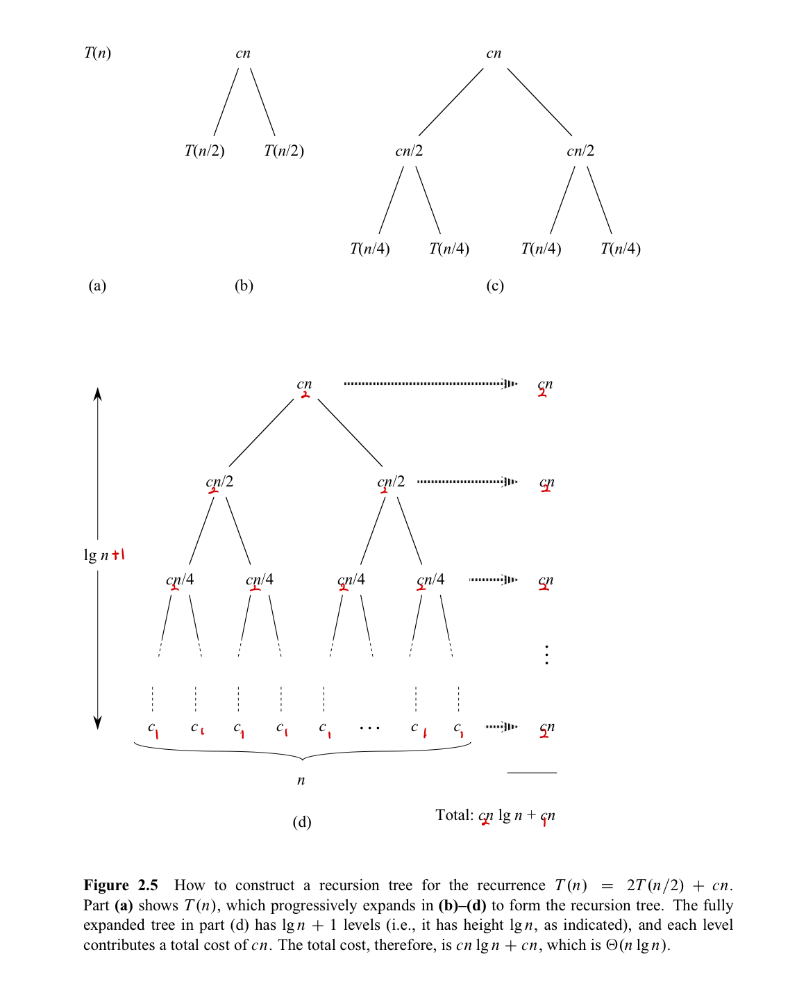

In this post, 02 Algorithm lecture is introuduced. 


CLRS chapter 1, 2의 내용을 다룬다.

# 1.1 Algorithm

**algorithm** : Informally, an **algorithm** is any well-defined computational procedure that takes some value, or set of values, as **input** and produces some value, or set of values, as **output**. An algorithm is thus a sequence of computational steps that transform the input into the output. input, output을 명시하는 게 중요함.

**correctness of algorithms** : algorithm에 있는 모든 스텝을 따라가면서 correct 하고, 모든 computational step을 따라가면서 time complexity 를 구해야 한다. 따라서, merge sort의 correctness 와 quick sort의 correctness 를 보이는 방법은 다르다.


# 2.1 Loop Invariant & Correctness

**Loop Invariant** 란, 루프에서 모든 반복 시의 전후로 변하지 않는 성질을 의미한다. (A loop invariant is *a condition [among program variables] that is necessarily true* immediately before and immediately after each iteration of a loop.) CLRS 정의의 기준으로는 전후라는 말보다는 전이라는 표현이 더 정확해 보인다.

Loop Invariant 는 알고리즘의 타당성 (correctness) 을 보이기 위해 사용된다. Loop invariant 를 보이려면 다음 세 가지 특성을 만족함을 보여야 한다.

1. **Initialization** : 루프가 첫 번째 iteration 을 시작하기 전에 참이다.
2. **Maintenance** : 루프의 반복이 시작되기 전에 참이면, 다음 반복이 시작되기 전에도 참이 유지된다.
3. **Termination** : 루프가 종료될 때, invariant 가 알고리즘의 타당성을 증명하는 데 유용한 특성을 가져야 한다.

Initialization 과 Maintenance 만 만족하면 Loop Invariant 는 항상 참이다. 마치 수학적 귀납법에서 base case 와, inductive case 를 증명하는 것과 같다. 하지만 Loop Invariant 를 보이는 목적은 결국 알고리즘의 타당성을 보이는 것이기 때문에 세 번째 조건이 가장 중요하다.

**Insertion Sort** 의 pseudo code를 바탕으로 Loop Invariant 를 설정하고, 이를 통해 알고리즘의 타당성을 보이자.

```pseudocode
INSERTION-SORT(A, n)
1 for i = 2 to n
2 	key = A[i]
3 	// A[i] 를 정렬된 배열 A[1:i-1]에 삽입한다.
4 	j = i - 1
5 	while j > 0 and A[j] > key
6 		A[j+1] = A[j]
7 		j = j - 1
8 	A[j+1] = key  
```

Insertion sort 의 위 코드에서 Loop invariant를 다음과 같이 정하자.

**1 - 8 행의 부분 배열 A[1:i-1] 은 for 루프가 반복을 시작할 때마다 원래 A[1:i-1] 의 원소가 정렬된 순서로 구성된다.**

- Initialization : i = 2 일때, A[1] 은 원래 원소 A[1]의 값으로 정렬되어 있다.
- Maintenance : for 루프의 바디 부분은 A[i] 의 올바른 위치를 찾을 때까지, A[i-1], A[i-2], ... 을 오른쪽으로 한 자리씩 이동시키는 작업을 한 뒤 (4-7행) A[i] 값을 적절한 위치에 삽입한다 (8행). 그러면 배열 A[1:i] 는 기존 배열 A[1:i] 와 동일한 원소들의 집합을 정렬된 상태로 갖게 된다. i 가 1씩 증가하면서 for 루프의 다음 반복에서 루프 불변성이 유지된다.
- Termination : for 루프는 i 가 n+1과 같아지면 종료된다. Loop invariant 에 i = n+1을 대입하면, 부분 배열 A[1:n]은 원래 A[1:n]에 있는 원소들로 정렬된 순서대로 구성된다. 따라서 알고리즘은 타당하다.


# 2.2 Running Time & Analyzing

알고리즘의 Running Time은 수행되는 line-by-line 으로 수행시간을 구해 이를 모두 더하는 방식으로 계산한다.

의사코드의 각 행을 수행하는데 상수 시간이 소요되며 행마다 수행 시간이 다르므로 $k$ 행을 수행하는데 $c_k$ 의 상수 시간이 걸린다고 하자. 또한, $t_i$를 위 예제에서 while 루프의 검사가 해당 $i$ 값에 대해 수행되는 횟수라고 하자.

| Line Number                                   | Cost  | Time                    |
| --------------------------------------------- | ----- | ----------------------- |
| 1 for i = 2 to n                              | $c_1$ | $n$                     |
| 2 key = A[i]                                  | $c_2$ | $n - 1$                 |
| 3 // A[i] 를 정렬된 배열 A[1:i-1]에 삽입한다. | 0     | $n - 1$                 |
| 4 j = i - 1                                   | $c_4$ | $n - 1$                 |
| 5 while j > 0 and A[j] > key                  | $c_5$ | $\sum_{i=2}^{n} t_i$    |
| 6 A[j+1] = A[j]                               | $c_6$ | $\sum_{i=2}^{n} t_i -1$ |
| 7 j = j - 1                                   | $c_7$ | $\sum_{i=2}^{n} t_i -1$ |
| 8 A[j+1] = key                                | $c_8$ | $n−1$                   |

위 표의 모든 $Cost * Time$ 을 더해서 구하면 $T(n) = an^2 + bn +c $ 꼴로 나타난다. 


# 2.3 Designing Algorithms 

알고리즘을 설계하는 방식은 여러 가지이다. 

- Insertion Sort 의 경우 원소 A[i]를 정렬된 부분 배열 A[1:i-1]의 적절한 위치에 삽입하여 다시 정렬된 부분 배열 A[1:i]를 만드는 **Incremental (점진적인)** 방법을 사용한다.
- Merge Sort 의 경우 **Divide-and-conquer** 접근법을 따른다. **Recrusive** 구조를 가진 알고리즘들은 전형적으로 Divide-and-conquer 접근법을 따른다. Base case가 아닌 Recursive Case에 대해
  - **divide** - **conquer** - **combine** 의 단계를 거치며 재귀적으로 문제를 푼다.

Merge Sort 의 Running Time 을 구해보자. Divide-and-conquer 알고리즘에서 일반적으로 수행시간은 다음과 같은 점화식 구조로 나타낼 수 있다. 

$T(n) = 
\begin{cases}
  \theta(1), & \text{if } n < n_0 \\
  D(n)+aT(n/b)+C(n), & \text{if } otherwise
\end{cases}$

여기서 $D, T, C$ 는 각각 divide, conquer, combine 단계에서의 수행시간이다. Merge Sort의 경우, $D(n) = \theta(1)$ , $C(n) = \theta(n)$, $a=b=2$ , $n_0 = 1$임을 쉽게 알 수 있다.

$T(n) = 
\begin{cases}
  c_1, & \text{if } n = 1 \\
  2T(n/2)+c_2n, & \text{if } n > 1
\end{cases}$

이 점화식을 풀 수 있는 3, 4가지의 방법을 4장에서 배울텐데, 그 중 한가지 방법인 **recursion-tree method** 를 간단히 소개한다. 그림으로 충분히 이해 가능할 것이다. 



