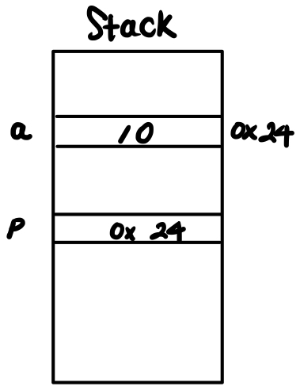
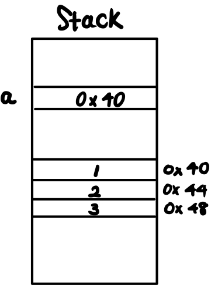
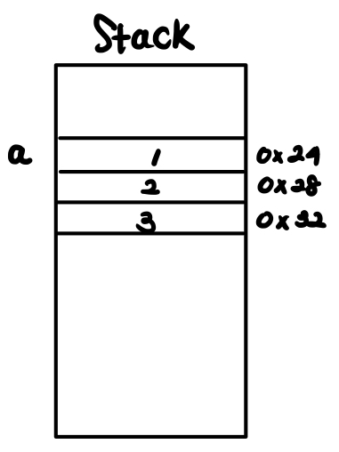

In this post, memory structure of Java, C and python is introduced.


RISC-V CPU Architecure 를 기반으로 설명한다. 

# C

- **Text** 

  - 프로그램 코드 (명령어) 가 존재한다

- **Stack** 

  - **지역변수** 저장
  - 지역변수 `x=3;` 이 있을 때, 이 3은 작은 값이므로 memory의 data 영역에 존재하지 않고, Text 영역에 명령어에 immediate 값으로 포함되어 존재한다. 이후, 레지스터에 저장되게 되고 이 값이 스택에 저장되는지는 레지스터가 현재 연산 중 부족한지, 함수 호출로 기존 레지스터 값을 저장해야 하는지 여부에 따라 다르다.

- **Data (Static Data)**

  - 초기화된 데이터 영역 (.data)

    ```c
    // 초기 값이 있는 전역변수, 정적변수 저장
    int g = 10; // 초기 값이 있는 전역변수(global)
    static int s1 = 20; // 초기 값이 있는 정적변수(static global)
    void foo(){
      static int s2 = 0 ; // 초기 값이 있는 정적변수(static local)
    }
    ```

    똑같이 `x=3;` 이라는 코드를 작성하더라도 x가 지역변수라면 다음과 같이 명령어가 실행된다.

    ```go
    addi a0, x0, 20   # 즉시값을 이용해 레지스터에 직접 저장
    sw   a0, -4(sp)   # 필요 시 스택에 저장
    ```

    반면, x가 정적변수라면 실행 중에 스택처럼 사라지지 않고 **항상 유지**되어야 하므로, 메모리에 반드시 자리가 있어야 하므로 .data 영역의 초기값으로 들어가고, 코드에서는 보통 다음처럼 접근한다.

    ```go
    la   a0, s1       # s1의 주소 로드
    lw   a1, 0(a0)    # s1 값 로드 (20)
    ```

  - 초기값이 없는 전역/정적변수 저장 (.bss)

    ```c
    int g2;        // 전역 변수 (초기화 안 함 → 자동 0)
    static int s2; // static 변수 (초기화 안 함 → 자동 0)
    ```

    global, static global, static local 변수의 기능에 대해서는 <a href="https://arcstone09.github.io/study/2025-06-21-ca-1"> 여기 </a> 를 참고하기 바람.

- **Heap** 

  -  Java의 new 나, C의 malloc 같이 새로운 메모리를 할당하고 더 이상 필요하지 않으면 return을 하는 것을 **dynamic data** 라 한다. dynamic data를 관리하는 공간을 heap 이라고 한다. 

  - dynamic data는 언제 return 될지 모르기 때문에 return 후에 사라지는 stack 과 다른 공간에 저장이 필요하다. 따라서 heap 이라는 별도의 영역을 사용하고 이 때 heap은 stack의 반대 방향부터 할당한다. 때로는 stack이 많이 필요할 수도, 때로는 heap 이 많이 필요할 수도 있기 때문에 이렇게 서로 반대 방향에서 자라게 한다.

    ```c
    int main(){
      int *arr = (int *)malloc(3 * sizeof(int));	
    }
    ```

    다음과 같은 코드에서 arr은 지역변수 이므로 arr 의 값은 stack 영역에 저장된다. 이 때, stack에 저장되는 값은 malloc이 return 한 heap 영역의 시작 주소가 있다.

- **RODATA (Read-Only Data)**

  - 상수(Constant), 리터럴 저장

## Constant

우선, **리터럴 (literal)** 이란, 코드에 직접 적혀 있는 값 자체를 의미한다. `int x = 3;` 에서 3과 같은 것이다.

**상수 (constant)** 는 값이 변하지 않는 데이터를 의미하는데 크게 두 가지 맥락이 있다.

- 언어 차원의 상수

  - `const` 키워드로 선언한 변수 (값을 바꿀 수 없음)

    ```c
    const int x = 3; // x는 상수 변수, 3은 리터럴 
    ```

    **지역 const 변수**는 지역변수이므로 stack 또는 레지스터에 저장된다.

    **전역 const 변수**는 기본적으로 RODATA에 저장된다.(옵션에 따라 .data에 저장되기도 한다)

- 메모리 구조에서의 상수

  - 프로그램 안에서 **읽기 전용 데이터(RODATA)** 로 저장되는 값들을 의미한다.

  - 문자열 리터럴, 전역 const, 큰 부동소수점 값 등이 여기에 해당한다.

    - 전역 const : 프로그램이 끝날 때까지 값이 바뀌면 안되므로, .data가 아닌 별도의 메모리 공간인 RODATA에 저장. 잘못된 쓰기 시도가 있을 때 즉시 Segmentation Fault를 내주므로 별도의 공간 사용.

    - 큰 정수, 부동소수점 : <a href="https://arcstone09.github.io/study/2025-06-21-ca-1"> 여기 </a> 에서 우리는 RISC-V 32-bit 아키텍처에서 큰 상수를 두 개의 명령어 조합으로 immediate을 이용해 가져오는 방법을 배웠다. 이런 경우라면 RODATA 에 저장하지 않는다. 하지만 매우 큰 상수나 부동소수점의 경우에 이렇게 표현하는 것이 힘들 때가 있고 또는 아주 큰 상수가 자주 등장하는 경우 매번 `lui+addi`를 쓰는 것보다 `.rodata`에 한 번 박아두고 필요할 때마다 `lw` 로 읽는 게 코드 길이를 줄이기에 유리하다.

      다음과 같은 경우를 생각하자.

      ```c
      int main() {
          double pi = 3.14159265358979323846;
          pi = pi * 2;
      }
      ```

      리터럴 3.14... 는 immediate 로는 담을 수 없고 따라서, .rodata 섹션에 저장된다. 

      `main` 함수 실행 시 스택 프레임에 `pi` 공간이 할당되고 **.rodata에 있는 3.14.. 값을 스택의 pi 위치로 복사** 한다.

      이후 `pi = pi * 2;` 같은 연산은 스택에 있는 `pi`를 불러다가 FPU 레지스터 (부동소수점 계산을 위한 별도의 레지스터 장치)에 올려 계산하고, 다시 스택에 저장한다.

    - 문자열 리터럴 : C 표준 규정: 문자열 리터럴은 수정 불가하다.

      C에서 문자열은 널 종료 문자(`'\0'`)로 끝나는 `char` 배열이다. 다음과 같은 경우를 생각하자.

      ```c
      char *s = "Hello";
      ```

      문자열 리터럴 `"Hello\0"` 는 .rodata 영역에 저장되고 stack 의 `s` 에는 그 시작 주소가 저장된다. .rodata 영역은 수정 불가하므로 다음의 코드는 불가능하다.

      ```c
      char *s = "Hello";
      s[0] = 'h'; // 불가능
      ```

      반면, 다음 코드를 보자. 문자열 리터럴 `"Hello\0"` 는 .rodata 영역에 저장되고 stack 의 `s` 에는 그 시작 주소가 아닌, 복사된 배열 `[H,e, l,l,o,\0]` 가 저장된다 (그 이유는 바로 아래 Array 파트 내용을 읽어보자). 따라서, 값의 변경이 가능하다.  

      ```c
      char s[] = "Hello";
      s[0] = 'h';   // 가능
      ```

      

  ## Array

  ```c
  int a[3] = {1,2,3};
  ```

  여기서 `a` 는 변수가 맞다. 따라서, 위에서 배운 내용처럼, 지역변수이면 stack에, 전역/정적 변수이면 .data나 .bss에, 동적할당 배열이면 (위 malloc 예제) heap 에 생성된다. 

  여기서 배열 이름 `a`  가 많은 상황에서 포인터 변수 인 것 처럼 행동한다.

  우선, 다음 포인터 코드를 보자.

  ```c
  int main() {
      int a = 10;       
      int *p = &a;
    	printf("%p\n", p); // 0x24
      printf("%p\n", &a); // 0x24
  }
  ```

  이 때, 메모리 구조를 보면 다음과 같다.

  

이제, 다음 배열 코드를 보자.

```c
int main(){
  int a[3] = {1, 2, 3};
  printf("%p\n", a); // 0x24
  printf("%p\n", &a[0]); // 0x24
}
```

첫 번째 포인터 예제에서 포인터 변수 `int* p = a;` 의 관계였는데, 배열 예제에서 출력 결과를 보니 `a` 와 `a[0]` 의 관계가 포인터 예제에서 `p` 와 `a`의 관계에 동일한 것처럼 보인다. 따라서, 이렇게 생각할 수 있다.

`int* a = &a[0];` 이를 토대로 메모리 구조를 그리면 다음과 같다 (주소 값이 24가 아40 인것은 무시하자). 


​									 

하지만 이는 오해이다. 배열 이름은 진짜 포인터 변수가 아니다. 실제로는 `a` 위치에 어떤 주소가 아니라 바로 배열의 값 1, 2, 3 이 순서대로 저장된다. 참고로 자바에서는 heap 영역에 1, 2, 3이 저렇게 저장된다.



다만, `a` 가 그냥 변수가 아닌 배열 변수일 때는 `a` 의 값으로 첫 번째 원소의 주소값을 저장하는 포인터 변수 처럼 이용되도록 하는 C의 문법적 규칙이 존재하는 것이다. 어찌되었건 `a` 가 진짜 포인터 변수는 아니기 때문에 다음과 같이 주소 값을 바꾸는 연산은 불가하다.

```c
a = a + 1;  // 불가능
```

