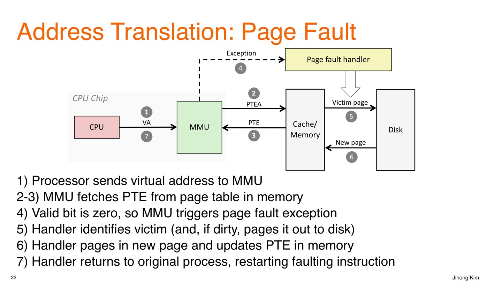

In this post, overral concepts of cache, pipelining and ISA is introuduced. 

# To begin
지난학기 Logic Design, 이번학기 Computer Architecure 강의를 수강하며 추상적이었던 컴퓨터의 동작 방식에 대한 이해가 높아졌다. 총 4편의 글을 통해 두 학기 동안 배운 내용을 정리하고자 한다. 배울 때는 Logic Design에서 가장 밑바닥인 트랜지스터의 구성부터 Computer Architecure 수업에서 ISA, Pipelining, Cache의 순서로 배웠다면 정리를 하는 입장에서는 그 역순으로 가장 큰 그림부터 가장 세부적인 그림까지 보는 방식으로 하여 이해를 높이고자 한다. 01 에서는 Cache-Pipelining-ISA의 순서로 CPU가 어떻게 동작하는지를 알아볼 것이다. 02에서는 BSV라는 언어로 해당 개념들을 어떻게 구현했는지 lab 과제 중심으로 알아볼 것이다. 03에서는 modern cpu의 구조에 알아본다. 04 에서는 Logic Design에서 배운 회로의 개념을 더한다. 

❗이 글에서는 RISC-V 32 bit architecure를 중심으로 글을 전개한다. 32 bit 이라고 할때 무엇이 32인지 헷갈릴 수 있다. 레지스터의 개수인가? 명령어의 길이인가? 레지스터가 저장하는 비트 수인가? 정답은 마지막이다. 하나의 레지스터가 저장하는 비트수가 32 bit인 것이다.

이 글의 내용을 통해, 컴퓨터가 CPU가 메모리의 명령어를 어떻게 순차적으로 수행하며 그 과정에서 어떤 최적화 기법들을 이용하는지, 컴퓨터 구조에서 하드웨어의 책임과 소프트웨어의 책임은 어디까지인지인지에 대한 이해를 쌓을 수 있다. 

# Cache - Virtual Address
IF-ID-EX-MEM-WB 5단계로 동작하는 파이프라인 구조를 생각하자. 이때 메모리에 접근이 필요한 단계는 언제인가? 우선 IF 단계에서 다음 명령어의 주소를 fetch하기 위해 메모리에 접근해야 한다. 또, MEM 단계에서 Store나, Load 명령어를 수행할 때 메모리에 접근하게 된다. CPU는 컴파일러가 만들어준 명령어를 차례로 수행하는데 아래 그림은 명령어의 수행 과정 중, 메모리 접근이 필요한 IF 단계와 MEM 단계에서 가상 주소를 물리 주소로 변환하는 과정을 나타낸 그림이다. 예를 들어, **IF 단계에서 CPU는 pc register에 있는 값에 있는 가상 주소의 값을 물리 주소로 변환하여 해당 물리 주소의 위치에서 명령어를 fetch 해오게 된다**. 

❗IF 단계와 MEM 단계에서 CPU는 메모리 접근이 필요할 때 그때마다 가상 주소를 물리주소로 변환한다. MMU는 CPU의 구성 요소로서 가상 메모리 시스템에서 CPU가 사용하는 가상 주소(Virtual Address)를 실제 물리 주소(Physical Address)로 변환해주는 하드웨어 장치이다.

// ❗**컴파일러나 어셈블러가 만들어내는 `st`, `ld`, `mov` 등의 명령어에 포함된 주소는 "가상 주소"가 아니다.**
좀 더 정확히 말하면, **"가상 주소가 될 수 있는 상대적 정보(오프셋)"를 담고 있을 뿐이다.** **진짜 가상 주소는 OS가 실행 시점에 정해준다.** 어쨌든 cpu가 명령어를 하나씩 읽어오는 시점에서는 가상주소정보를 읽어오는 것이다.

❗**프로그램이 실행될 때 OS가 가상주소 공간을 할당한다. OS는 첫 명령어의 가상 주소 (entry point)를 정한다. CPU는 이 가상주소를 PC에 넣는다. MMU가 이 가상주소를 물리주소로 변환한다. 이후 명령어 fetch가 진행된다.** 

🔵 **명령어 생성(컴파일러)**




지금까지의 논의에서 다음과 같은 질문이 생길 수 있다. 

1. IF-ID-EX-MEM-WB 각 단계가 무엇을 의미하는가?
2. Store, Load 등 명령어가 무엇인가
3. 가상 주소를 사용하는 이유는 무엇인가?
    1번 질문에 대한 답은 글의 중반부 Pipelining에서 얻을 수 있다. 2번 질문에 대한 답은 글의 후반부 ISA에서 얻을 수 있다. 우선 3번 질문 가상 주소를 사용하는 이유에 대해 알아보자.
    프로그램이 물리주소를 직접적으로 이용하여 메모리에 접근한다면 크게 두 가지 문제점이 생길 수 있다. 우선 만약, Physical Memory의 크기를 벗어나는 프로그램을 작성하게 되면 문제가 생긴다. 예를들어, 어떤 컴퓨터가 4MB의 물리 메모리 시스템을 가지고 있는데 프로그램이 8MB의 메모리 요구량을 가진다면? 이 프로그램은 돌아가지 않을 것이다. 또한, 프로그램은 돌아가는 컴퓨터의 환경에 따라 돌아갈수도 돌아가지 않을 수도 있을 것이다. 다음으로, 여러 개의 프로그램 A, B, C가 같이 수행되는 경우 물리주소를 나눠서 프로그램별로 할당해야 한다. 이때 프로그램 D를 추가로 작성하려고 하면 메모리 할당을 새롭게 해야한다. 

이제 가상 주소를 물리주소로 바꾸는 과정을 자세히 알아보자. 


위 그림을 기준으로 설명하면,

1. CPU가 변환해야 할 48 bits의 가상 주소 (예를 들어, IF 단계에서 PC+4) 정보를 제공
   - 상위 36 bits는 VPN 으로 해당 가상 주소가 속한 page number를 나타내고
   - 하위 12 bits는 VPO 으로 해당 page 내에서 가상 주소의 위치를 나타내는 오프셋 역할을 한다.
2. VPN으로 TLB에서 해당하는 VPN 이 있는지 확인한다. **TLB는 MMU에 존재하는 고속 캐시로 PTE가 존재하는 L1 cache 영역보다 빠르게 접근이 가능하다.**
   - VPN의 하위 4 bits로 TLB에서 해당하는 set을 찾고
   - 상위 32 bits tag가 해당하는 set의 4개의 entry 중 하나에 존재하고 Valid = 1인지를 확인한다. 그렇다면 해당 entry에서 PPN을 읽고, 그렇지 않다면 TLB Miss가 발생한 것이다. 
   - 위 그림과 같은 경우를 16 sets, 4-**way associative** 라고 한다. 
   - TLB의 각 entry에서는 다음의 정보를 저장한다.
     - Tag : 32 bits VPN을 의미한다.
     - PPN : VPN에 대응하는 실제 물리 페이지 번호를 의미한다. 
     - Valid : 해당 TLB entry의 정보가 현재 유효한지를 나타낸다. TLB Miss가 발생하면, 페이지 테이블에서 정보를 조회한 후, TLB에 새로운 entry를 저장할 때 Valid를 1로 한다. **(Q : 이 과정이 모두 If 단계에서 일어나는가?)** 따라서, 처음 접근되는 페이지는 TLB Miss가 발생할 수 밖에 없다. 
     - Dirty :  TLB 혹은 페이지 테이블에 있는 VP들은 모두 대응하는 물리 메모리의 공간을 차지하고 있다. 운영체제가 **페이지를 물리 메모리에서 디스크로 쫓아낼(evict) 때**, 해당 페이지가 **수정된 적이 있다면 (dirty = 1)** **디스크에 다시 써줘야 한다. (write-back)** TLB miss가 나면 → 페이지 테이블에서 dirty 값을 확인하고, TLB에 로딩할 때 dirty 값도 함께 가져온다.
     - Ref : LRU를 구현하기 위한 비트. LRU (Least Recently Used)는 가장 오랫동안 사용되지 않은 데이터를 가장 먼저 제거하는 캐시 교체 알고리즘이다. TLB Miss가 발생하면, 페이지 테이블에서 정보를 조회한 후, TLB에 새로운 entry를 저장해야 하는데, 이 때 기존 4개의 entry 중 무엇을 제거할 것인지에 대한 기준이 필요하다. Ref = 1 이라는 것은 특정 인터벌 안에서 해당 페이지가 접근 되었음을 의미한다.


# Cache

To be continue....


# Exception

밑에 다룰 ISA의 내용만으로는 

- `Jumps and branches`: 조건문이나 루프에서 쓰이는 점프/분기
- `Call and return`: 함수 호출 및 복귀

위 두 메커니즘을 이용해 **program state (프로그램 상태)**의 변화에만 반응할 수 있다. 즉, **내부 로직 흐름에 대한 제어**만 가능하다. 하지만 현실적인 시스템은 외부 환경, 하드웨어, 사용자의 예기치 못한 행동 등으로 인해 **system state (시스템 상태)**가 변하는데, 기존 방식은 이런 상황을 다루기 어렵다. 

+ **디스크나 네트워크 어댑터에서 데이터 도착**

- **명령어 실행 중 0으로 나누기 발생**

- **사용자가 키보드에서 Ctrl+C 입력**

- **시스템 타이머 만료**

따라서, **Exceptional Control Flow** 가 필요하다. **Excpetional Control Flow** 란, 컴퓨터 시스템의 모든 **계층(Layer)**에서 존재하는 제어 흐름 변경 방식을 말한다.  계층에는 **하드웨어 레벨**, **운영체제 레벨**, **런타임 라이브러리 레벨**, **응용프로그램 레벨** 이 있다. 

Low-level 에서는 **Exception**을 처리하는 방식으로 제어가 이루어진다. **Exception**이란, 시스템 이벤트에 반응해 제어 흐름이 변경되는 것을 의미한다.(An **Excpetion** is a transfer of control to the OS Kernel in response to some event) 하드웨어와 OS software의 조합으로 동작한다. 예를 들어, **Divide by 0 Exception**이 발생하는 경우를 생각해보자.

1. 유저 프로그램 실행 중
   - CPU가 DIV 명령어를 해석하다가 0으로 나누는 상황을 감지
   - 이 시점에서 하드웨어 수준 **Divide by 0 Exception** 이 발생
2. CPU 내부 동작 (하드웨어 제공)
   - 현재 실행 상태(Reg, PC 등)을 스택/특정 메모리에 저장
   - 특정 예외 벡터 주소르 PC를 변경
     - 이 예외 벡터 주소에는 OS 커널의 예외처리 루틴 코드의 시작 위치가 들어 있음
3. OS 커널 코드 실행 (소프트웨어 영역)
   - 커널의 예외 처리 루틴(메모리에 존재) 에서 상황 분석
   - 적절한 대응(프로세스 종료, 페이지 로드, 시그널 전달 등) 수행
   - 필요한 경우 다시 원래 프로그램의 다음 명령어로 복귀
4. 복귀 또는 종료
   - 복귀 시 저장된 Reg, PC를 복원
   - 종료 시 해당 프로세스 자원 해제

Exception 마다 해당하는 번호가 있다. 예를들어 **Divide by 0** 의 Exception Number을 0이라고 하면 CPU가 해당 예외를 감지했을 때, Exception Table의 0번 entry를 방문한다. 여기에는 해당 예외에 대한 예외 처리 루틴 주소가 매핑되어 있다. 


❗Pipleline이 20단계라고 가정했을 때, 10단계 진행중인 instruction에서 Exception이 발생하면, 11~20 단계의 instruction은 수행을 마치도록 보장해주어야 한다.

❗실행되어야 할 instruciton 순서가 1->2->3->4 일 때 실제 Pipeline에서는 in order로 1->2->3->4 수행되지 않는다. 최적화를 위해 3->4->1->2 처럼 out of order로 수행되는데 이 때, 1에서 exception이 발생하면 3, 4를 수행하기 전으로 복원해야 하는데, 이 overhead가 크므로 커밋 (머신 상태를 바꾸는 일) 은 out of order로 수행하지 않는다. 중간 수행은 out of order로 해도 마지막 커밋은 in order로 한다.  

ECF의 Higher-level 메커니즘에는 다음이 있다.

- **Process Context Switch** 
  - 여러 프로세스를 번갈아 실행하기 위해, 현재 실행 중인 프로세스 상태를 저장하고 다른 프로세스 상태로 교체하는 과정
  - 하드웨어 타이머 + OS software 로구현됨
- **Signals**
  - 실행 중인 프로세스에 비동기 이벤트를 알리는 메커니즘
  - Ex : SIGINT (Ctrl+C), SIGKILL
  - OS software로 구현됨
- **Nonlocal Jumps (setjmp() / longjmp() in C) **
  - C 런타임 라이브러리에서 제공하는 기능으로, 함수 호출 스택을 건너뛰고 특정 지점으로 바로 점프 가능
  - 예외 처리나 긴급 복구 상황에서 사용


Exception에는 **Asynchronous Exception (Interrput)** 과 **Synchronous Exception**이 존재한다.

1. **Asynchronous Exception (Interrupt)**

   - CPU 외부에서 발생한 사건에 의해 발생하는 예외를 의미한다. 즉, 현재 CPU가 실행 중인 명령어와 직접적인 연관이 없다.
   - 외부 장치에서 CPU의 interrupt pin에 신호를 전달하여 exception을 알린다.
   - 처리 흐름
     - 외부 장치 (타이머, 키보드, 디스크 등) 에서 이벤트 발생
     - CPU의 interrupt pin 활성화
     - CPU가 현재 명령어를 끝낸 후 커널의 interrupt handler로 제어 이동 (현재 명령어를 끝낸다는 것은 pipeline 안에 존재하는 모든 명령어의 수행을 완료한다는 것이다. 그동안은 새로운 명령어를 fetch 하지 않는다.)
     - 처리 후 next 명령어로 복귀
   - 예시
     - **Timer interrupt** : 몇 ms 마다, 타이머 칩이 interrupt를 발생시켜 OS가 CPU 제어권을 가져옴. 스케쥴링, 프로세스 전환 등에 사용
     - **I/O interrupt** : Ctrl+c 키 입력, 네트워크 패킷 도착, 디스크 데이터 읽기 완료

2. **Synchronous Exception**

   - CPU가 현재 실행 중인 명령어 수행 과정에서 발생하는 예외를 의미한다. 명령어와 직접적인 관련이 있다.

   - **Traps** : 의도적으로 발생시키는 Exceptions로 **system calls**, **breakpoint traps**, **special instructions** 가 있다.

     - interrupt와 동일하게 exception을 일으킨 명령어를 비롯해 파이프라인에 들어있는 현재 명령어를 모두 실행 후, 커널 진입. 이후 next 명렁어로 북귀.

     - **System Call** : 유저 모드에서 커널 모드로 진입하기 위한 공식적인 인터페이스. 유저 프로그램은 하드웨어(디스크, 네트워크, 화면 등)에 직접 접근할 수 없고 OS를 통해서만 접근 가능하다. System Call 실행절차는 아래와 같다.

       1. 프로그램이 라이브러리 함수를 호출 (printf, read, write 등)
       2. 라이브러리 함수 내부에서 trap 명렁어 실행
       3. trap이 CPU를 커널 모드로 전환 -> 시스템 콜 번호를 보고 해당 커널 함수 실행
       4. 결과를 유저 모드로 반환

     - **printf("hi")** 시 trap 발생 과정

       1. printf("hi") 호출 -> C 표준 라이브러리의 printf 함수 실행

          (컴파일러가 메모리에 있는 C 표준 라이브러리 printf 함수로 jump 하도록 컴파일 함)

       2. printf 내부에서 문자열 포맷 처리 후, 최종적으로 **write** 시스템 콜 호출. Ex. write(1, "hi", 2)

          (메모리에 있는 printf 함수는 내부적으로 write라는 시스템 콜 함수를 호출, 이 write 함수도 메모리에 존재)

       3. write 시스템 콜 함수는 내부적으로 trap 명령어 (RISC-V ISA 기준 **ecall**)를 실행

          (write함수는 우리가 원하는 프린트 동작 중 일부를 하도록 메모리에 작성되어 있음. sys_write 시스템 콜 번호 등을 레지스터에 로드. 다만 하드웨어에 접근한다는 의미에서 ecall 명령어 마지막에 사용)

       4. trap 명령어 실행 시, CPU에서는 현재 Reg, PC를 저장하고 커널로 전환한다. 예외 번호를 보고 exception table에서 sys_write 핸들러 주소를 로드한다.

       5. 커널 모드에서 sys_write 함수가 실행 후, trap에서 복귀하여 유저모드로 돌아와 printf 이후 코드를 계속 실행한다.

     - **breakpoint** : 디버깅 중 프로그램 실행을 특정 지점에서 멈추게 하는 기능이다. 멈추고자 하는 지점의 명령어를 저장해두고 그 자리에 특수 trap 명령어로 바꿔치기한다. 실행이 trap에 도달하면 디버거가 제어권을 얻어 변수 값 확인, 메모리 상태 조사 등을 할 수 있다.

   - **Faults** : 의도적이지 않지만 복구가 가능할 수도 있는 exception이다. 

     - Ex : **page fault** (복구 가능), **protection fault** (복구 불가능), **floating point exceptions**
     - 커널이 처리 후, 현재 명령어를 재실행하거나 프로그램 종료

   - **Aborts** : 의도적이지 않고 복구가 불가능하다.

     - Ex : illegal instruction, parity error, machine check
     - 즉시 프로그램을 종료한다.

   Fault나 Abort의 경우 Interrupt와 Trap과 다르게, CPU가 예외가 발생한 즉시, 예외 발생 지점 이후 파이프라인 안의 명령어들을 모두 flush 하고 예외 핸들러로 점프한다. 예외 발생 지점 이전 파이프라인 안의 명령어들은 모두 수행이 완료되고 예외 핸들러로 점프한다.(밑에서 설명할 Precise Exception일 경우에만 그렇다.) Fault의 경우, 복귀를 하게 되면 해당 명령어를 다시 fetch 해 실행한다. 

RISC-V 에서, 예외 발생 시, 하드웨어가 처리하는 기본 절차는 다음과 같다.

- Save PC of offending instruction
  - **SEPC** Reg에 예외를 발생시킨 명령어의 PC 값을 저장. Fault의 경우, 예외 처리 후 그 명령어를 다시 실행해야 하므로, 저장해야 한다. Trap은 보통 다음 명령어로 돌아가지만, 그래도 현재 PC 값을 저장.
- Save indiciation of the problem
  - **SCAUSE** Reg에 예외의 원인(코드)을 저장. 이 값은 OS 커널이 예외 처리 루틴에서 참조해 무슨 예외인지를 구분하는 데 사용
- Jump to handler
  - 커널의 예외 처리 루틴 시작 코드로 jump


파이프라인은 여러 명령어를 동시에 수행하므로, 동시에 여러개의 예외가 발생할 수 있다. 이 예외를 처리하는 방법에는 **Precise Exception**과, **Imprecise Exception**이 있다. 

- **Precise Exception** : 예외가 발생했을 때, 해당 명령어 이전까지의 명령어는 모두 정상적으로 완료되고 해당 명령어 이후의 명령어는 전부 flush 된 상태로 CPU 제어가 예외 처리기로 넘어가는 것.
  - 가장 먼저 발생한 명령어의 예외를 우선 처리
  - 그 이후 단계에 있는 명령어는 모두 flush
  - 예외가 발생한 명령어 주소와 원인을 SPEC, SCAUSE에 저장
  - OS 예외 처리기로 점프
  - Instruction이 4->3->2->1 순으로 out-of-order로 수행되는데 2에서 exception이 발생하면 1번의 commit이 정상적으로 끝나고 나서 수행.
- **Imprecise Exception** : 하드웨어에서 예외를 정렬하지 않고, 그 시점의 파이프라인 상태를 그대로 저장한 뒤, 소프트웨어가 어떤 명령어가 실패했는지 직접 찾아서 처리하게 하는 방식
  - 하드웨어 구현이 단순해지지만, 소프트웨어 예외 처리기가 더 복잡해짐.
  - 복잡한 다중 out-of-order 파이프라인에서는 정확한 예외 순서를 복구하기가 어려워 현대 고성능 CPU 대부분 precise exception을 유지하려고 노력함.


# Pipeline and Solving Hazard

To be continue...


# Translating and Starting a Program

우리가 프로그램을 Compile 하면 Assembly를 만들어내고 Assembler를 불러서 Object 파일을 만들어낸다. 여러 개의 c파일 a.c, b.c 등의 파일에서 Object 파일을 만들어내고 이들을 하나의 Binary로 만드는 것이 Linker이다. 그렇게 만들어진 것이 Executable 인데, 이 파일을 실제 실행하려면 메모리에 옮겨져야 하는데, 이 일을 하는 것이 Loader 이다. Executable 안에 있는 instruction이 뭐가 있고 data가 뭐가 있는지 정해진 약속에 따라서 정해진 위치에 load 한 다음에 맨 처음 address로 start.


- **Object file**
  - 오브젝트 파일은 거의 실행 가능한 코드이지만, 아직 모든 주소나 외부 참조가 완전히 해결된 상태가 아니다. 
  
  - 오브젝트 파일 안에는 이미 기계어 명령과 데이터가 들어 있다. 하지만 다른 파일의 코드와 **link** 되지 않은 상태이다. 예를 들어, main.c에서 foo() 를 호출했지만 foo() 가 util.c 에 구현되어 있다면, 현재 단계에서는 foo 의 실제 주소를 모른다. 
  
  - 한 파일에서 정의한 함수/변수를 다른 파일에서 사용하려면 **symbol** 연결이 필요하다. 오브젝트 파일에는 '이 이름의 함수나 변수를 호출/참조해야 함' 이라는 외부 참조 표기만 있고, 실제 주소는 나중에 링커가 채운다.
  
  - 오브젝트 파일은 실행파일을 만들기 위해 필요한 부가 정보를 함께 가지고 있다.
    - **Header** : 오브젝트 파일의 전반적인 구조와 크기 등 메타데이터.
    - **Text segment** : 실제 기계어 코드 (명령어) 가 들어 있는 영역. 
    - **Static data segment** : 전역 변수, static 변수 등을 저장. 
    - **Relocation info** : 아직 확정되지 않은 주소나 참조에 대한 정보. main.c 에서 foo() 함수의 선언과 호출은 있지만 정의는 util.c에 있을 때, foo(); 호출 코드를 머신 코드로 바꾸려면 foo() 의 주소가 필요하지만 어디있는지 현재는 모름. 따라서, 외부 심볼 foo가 필요함이라고 기록. (Symbol Table 상에서 U foo 로 표시됨). 호출 명령의 위치에는 '이 자리에는 foo 주소가 들어와야 함' 이라는 재배치 정보만을 남김. util.c 에는 foo가 정의되어 있으므로 Symbol Table에 foo를 T foo로 등록. 이 때 T는 text 섹션에 정의되었다는 뜻. 그리고 foo의 코드가 .text 섹션에 저장됨.
    
    - **Symbol table** : 현재 파일 안에서 정의된 심볼(함수, 전역변수)과 외부에서 가져와야 하는 심볼 목록.
    - **Debug info** : 소스 코드와 기계어를 연결하는 디버깅 정보.
  
- **Linker**
  - 링커는 여러 Object file을 합쳐서 실행 가능한 프로그램을 만든다.
  - **Merge Segments** 
    - 각 .o file에는 자기만의 .text, .data, .bss 섹션이 있다. 링크는 이들을 하나의 큰 세그먼트로 합친다.
    - a.o의 .text + b.o의 .text → 실행파일의 .text 세그먼트.
  - **Resolve labels (determine their address)**
    - 함수명, 변수명 같은 심볼의 실제 주소를 결정
    - main.c 에서 호출한 foo() 가 util.o 에 정의되어 있으니, 링커가 foo의 최종 주소를 정해준다. main.o의 U foo 와 util.o 의 T foo를 확인하여 둘을 매핑한다(**symbol resolution**). 링커는 .text, .data 의 주소를 배치하고(**address assignment**) 이 때 배정된 foo의 주소를 바탕으로 Object file에서 남겨둔 재배치 정보에 해당 주소/오프셋을 채운다(**relocation**).
    - 옛날 시스템에서는 링커가 모든 주소를 확정하지 않고, 일부 주소 결정을 loader에게 미루었다. 즉, 실행파일을 메모리에 올릴 때 loader가 “여기 주소를 이렇게 바꿔야지” 하고 직접 고쳤다. 이를 **Relocating Loader**라고 한다. 하지만 현대 시스템에서는 **가상 메모리** 덕분에 이런 수고가 필요 없어졌다. 프로그램이 실행될 때 운영체제가 가상주소 공간을 만들어 주면 실행파일은 **미리 약속된 가상주소 영역**에 그대로 매핑하면 되기 때문에, loader 가 일일이 수정할 필요가 없다.
  - **Combine with static run-time libraries**
    - C 표준 라이브러리를 정적 링크하면, 필요한 함수 코드 (printf 같은 것)을 실행파일 안에 직접 복사한다.
  - **Some libraries are dynamically linked**
    - **static linking**의 경우, 실행 파일 크기가 커지고, libc가 업데이트 되면 다시 빌드해야 한다. 반면 **dynamic linking**을 이용하면 실행파일에는 printf  같은 함수가어느 공유 라이브러리(.so)에 있는지 정보만 기록한다. 실제 코드 자체는 실행파일에 들어가지 않고, 실행할 때 loader가 그 라이브러리를 찾아서 연결한다. 
  
- **Loader**
  
  - 사용자가 ./a.out 같은 실행 요청을 하면, **OS 커널**은 **process**를 만든다.
  
    - 프로그램이 실행 중일 때의 모습이 process 인데, 구체적으로 CPU, 메모리, 파일 디스크립터, 스택/힙, 레지스터 상태 등을 모두 갖춘 실행 단위를 의미한다.
  
  - **Load from image file on disk into memory**
  
    - **Read header to determine segment sizes** : 실행파일에는 헤더(ELF 헤더, 프로그램 헤더)가 있어서 .text는 어디서부터 몇 바이트, .dat는 어디서부터 몇 바이트 등의 정보가 기록되어 있다. loader 는 이 헤더를 읽고 어느 세그먼트를 어디에 매핑할지 (절대 가상주소를 결정. 실행파일 안에 절대 가상주소가 있는 경우도 있고 오프셋 정보만 있어 loader 가 정하는 경우도 있음).
    - **Copy text and initialized data into memory** : 실행파일의 코드 (.text)와 초기화된 데이터 (.data) 는 그대로 메모리에 복사됨. C 언어에서 초기값이 설정된 **전역변수/static 변수**는 실행파일의 .data 세그먼트에, 초기값이 없는 **전역변수/static 변수** 는 실행파일의 .bss 세그먼트에 저장되어 있다. .bss 세그먼트에는 “이 변수들이 필요하다, 크기는 얼마다”라는 정보만 기록되고, 실제 데이터(0 값들)는 들어 있지 않다. (그래서 실행파일의 크기가 불필요하게 커지지 않는다.) 프로그램 실행 시, loader가 .bss 영역을 확보하고 모든 바이트를 0으로 채운다.
  
    - **Set up stack** : 새 프로세스에는 빈 스택이 준비된다. 스택에는 argc, argv[], envp[] 같은 프로그램 실행 인자들이 초기값으로 채워진다.
    - **Initialize registers (including sp, fp, gp)** : 스택 포인터(sp), 프레임 포인터(fp), 전역 포인터(gp) 같은 레지스터들이 초기화된다. 
  
  - **Jump to startup routine**
  
    - CPU가 실행을 시작할 첫 주소, **entry point** 로 점프한다. 실행파일의 헤더에는 e_entry 라는 entry point의 주소가 기록되어 있고 거기로 점프한다. 이 entry point 는 보통 C 런타임의 _start 루틴이다. _start는 main() 을 바로 호출하지 않고, argc, argv, envp 를 register와 stack 에 올린 후 main(argdc, argv, envp) 를 호출한다. 
    - main이 리턴하면, _start는 exit() 시스템콜을 불러 프로세스를 종료시킨다.
  

## Memory Layout - How Variables are stored

- **Stack** : 가장 큰 주소에 stack을 할당하고 stack point가 가장 위를 가리키게 한다.

  - 함수 호출, **지역 변수** 저장, 리턴 주소 보관

- **Text** : 프로그램 코드 (명령어) 가 존재한다. 시작 주소 (entry point) 에서 부터 코드가 실행된다 (_start 루틴). 

- **Static Data** : **global 변수**, **static 변수 (static global, static local)**, **Constant** 등 저장. 프로그램 시작~종료까지 메모리에 존재한다.

  ```c
  int g = 10; // global
  static int s1 = 20; // static global
  void foo(){
    static int s2 = 0 ; // static local
  }
  ```

  - **global** : 함수 밖, 파일 전역에서 선언 / 파일 전체, 다른 파일에서 extern 키워드로 접근 가능
  - **static global** : 함수 밖, 파일 전역에서 선언 / 해당 파일 안에서만 사용 가능, extern 키워드로 접근 불가
  - **static local** : 함수 안에서 선언 / 함수 블록 내부에서만 접근 가능, 함수가 여러 번 호출되어도 값은 유지됨.(지역 변수인데 수명은 전역)
  - **global pointer** : 특정 register에 global pointer 값을 저장하여 base 주소 값으로 삼고 offset 만큼 움직여 모든 global 변수의 값에 접근. gp는 static area의 가운데를 가리키고 offset의 범위만큼 static area 가 설정된다.

- **Heap** : Java의 new 나, C의 malloc 같이 새로운 메모리를 할당하고 더 이상 필요하지 않으면 return을 하는 것을 **dynamic data** 라 한다. dynamic data를 관리하는 공간을 heap 이라고 한다. 

  - dynamic data는 언제 return 될지 모르기 때문에 return 후에 사라지는 stack 과 다른 공간에 저장이 필요하다. 따라서 heap 이라는 별도의 영역을 사용하고 이 때 heap은 stack의 반대 방향부터 할당한다. 때로는 stack이 많이 필요할 수도, 때로는 heap 이 많이 필요할 수도 있기 때문에 이렇게 서로 반대 방향에서 자라게 한다.

    ```c
    int main(){
      int *arr = (int *)malloc(3 * sizeof(int));	
    }
    ```

    다음과 같은 코드에서 arr은 지역변수 이므로 arr 의 값은 stack 영역에 저장된다. 이 때, stack에 저장되는 값은 malloc이 return 한 heap 영역의 시작 주소가 있다.

  - Stack 처럼 LIFO 같은 정책이 없다. 


```c
#include <stdio.h>
#include <stdlib.h>

// 전역 변수들
int g1 = 10;        // 초기값 있는 전역 변수 → .data 세그먼트
int g2;             // 초기값 없는 전역 변수 → .bss 세그먼트

void demo() {
    int local = 42;           // 지역 변수 → 스택(stack)
    static int s_local = 99;  // static 지역 변수 → .data 세그먼트

    int *heap_var = (int*)malloc(sizeof(int)); // malloc → 힙(heap)
    *heap_var = 77;

    printf("local (stack)       = %d, addr=%p\n", local, (void*)&local);
    printf("heap_var (heap)     = %d, addr=%p\n", *heap_var, (void*)heap_var);
    printf("g1 (global .data)   = %d, addr=%p\n", g1, (void*)&g1);
    printf("g2 (global .bss)    = %d, addr=%p\n", g2, (void*)&g2);
    printf("s_local (static .data)= %d, addr=%p\n", s_local, (void*)&s_local);

    free(heap_var); // 할당 해제
}

int main() {
    demo();
    return 0;
}

local (stack)       = 42, addr=0x7ffee1c2b7ac
heap_var (heap)     = 77, addr=0x600003e0
g1 (global .data)   = 10, addr=0x1043e1018
g2 (global .bss)    = 0, addr=0x1043e1020
s_local (static .data)= 99, addr=0x1043e1028
```


가상주소 -> 실제주소는 cpu 실행 중 mmu에서 실시간 처리.

컴파일(어셈블리어)된 코드는 가상주소의 오프셋 정보에 관련된 코드.

이 오프셋이 실제 가상주소로 연결되는 시점은 프로그램이 시작될 때 OS에 의해(loader?)

링킹은 이 코드나 데이터가 가상주소 어느 위치로 들어갈지 결정만 해두고 실제 메모리 적재를 로딩해서 한다고 생각.


# ISA

**Instruction Set Architecture** 란, 하드웨어와 소프트웨어 사이의 약속이다. **ISA** 는 CPU가 어떤 명령어를 지원해야 하는지에 관한 규칙을 정의하고 CPU 제조사는 그 규칙을 만족하는 하드웨어 회로 (마이크로아키텍처) 를 설계한다. **ISA** 에서 정의하고 있는 것들은 다음과 같다.

- **Instruction Set**
  - 어떤 연산을 할 수 있는지 (덧셈, 곱셈, 분기, 메모리 접근 등)
  - 각 명령어의 형식 (어떤 비트가 opcode 이고, 어떤 비트가 레지스터 번호인지 등)
- **Data Type**, **Register 구조**
  - 정수, 실수 처리 방식
  - 몇 비트 레지스터를 몇 개 제공하는지
- **Memory model**
  - 주소 공간 크기 (32 비트, 64 비트)
  - 정렬 규칙 (align), 메모리 접근 방식(load/store) 구조 등
- **Exception / Interrupt model** 
  - 시스템 호출, 오류 처리 방법
  - 모드 전환 (유저 모드 <-> 커널 모드) 방식

다음은 몇 가지 ISA 와 그에 따른 CPU 모델에 대한 소개이다. 앞으로 우리는 RISC-V 32 bit ISA 를 기준으로 ISA 에 대해 알아볼 것이다.

- **x86 ISA** 
  - Intel Core i9
  - AMD Ryzen
- **ARM ISA**
  - Apple M1, M2, M3
  - Qualcomm Snapdragon
  - Samsung Exynos
  - AWS Graviton
- **RISC-V ISA**
  - Alibaba Xuantie C910

## Instruction Types and Operations

Instruction 들은 그 형식에 따라 아래와 같이 6 가지의 type 으로 나뉘며 지원하는 Operation 의 성격에 따라 다음 3가지로 나뉜다.

- **Arithmetic / Logical Operations ** : 덧셈, and 와 같은 연산을 지원하는 명령어
- **Data Transfer Operations** : 메모리->레지스터로 data load, 레지스터->메모리로 data store 하는 명령어
- **Control Transfer Operations** : jump, 조건문, 함수 호출과 관련된 명령어


이제 우리는 지원하는 Operation의 성격을 기준으로 명령어들을 알아볼 것이다.

## Arithmetic / Logical Operations

|     Type (operations)      |            Instruction            |             Assembly Expression              |
| :------------------------: | :-------------------------------: | :------------------------------------------: |
| R  (arithmetic operations) |        add, sub, slt, sltu        |   add rd, rs1, rs2<br />sltu rd, rs1, rs2    |
|   R (logical operations)   |    sll, sra, srl, and, or, xor    |               sll rd, rs1, rs2               |
| I (arithmetic operations)  |         addi, slti, sltiu         |             addi rd, rs1, imm12              |
|   I (logical operations)   | slli, srai, srli, andi, ori, xori | addi rd, rs1, imm12<br />srli rd, rs1, shamt |
| U (arithmetic operations)  |            lui, auipc             |      lui rd, imm20<br />auipc rd, imm20      |

몇 가지 명령어의 기능을 살펴보면 다음과 같다.

- sltu rd, rs1, rs2 : 두 register rs1과 rs2의 값을 부호 없는 정수 취급하여 비교하여, rs1 < rs2 이면 rd = 1, 아니면 rd = 0
- sll rd, rs1, rs2 : shift-left logical 의 약자. rd = rs1 << (rs2의 하위 5비트 값). 왼쪽으로 비트를 밀고, 빈자리는 0으로 채움
- addi rd, rs1, imm12 : rs1 + 12비트의 immediate 상수 값을 더해 rd에 저장
- lui rd, imm20 : rd = imm20 << 12. 레지스터의 상위 20비트에 즉시값을 로드하고, 하위 12비트는 0으로 채움.
- auipc rd, imm20 : rd = PC + (imm20 << 12). 현재 PC(program counter)에 즉시값 상위 20비트(<<12) 를 더한 값을 레지스터에 저장.

### Constants

아래와 같이 상수가 포함된 코드를 RISC-V 에서 어떻게 처리할까.

```c
x = x + 5;
```

한 가지 방법은 constant를 variable로 만들어 stack 에 저장하는 것이다. 하지만 메모리에 접근하는 것은 느린 동작이기 때문에 실제로 이렇게 하지는 않는다.

Promgram을 분석해보면, 대부분 사용하는 constant의 값은 작은 값이다. 예를 들어, x > 0 같은 구문은 매우 자주 쓰이는데, 이 때 상수 0이 쓰인다. Constant 마다 사용 빈도의 차이가 있고 이러한 차이는 최적화의 요소가 된다. **Make Common Case Fast** 는 컴퓨터 구조 최적화의 핵심 모토이다. 컴퓨터 프로그램에서 상수는 0->1->작은 값->random 순으로 중요도 (빈도 측면) 를 가진다. 이제 각각의 상수를 어떻게 취급하는지 알아보자. 

- 0 : **hard-wired zero register ** 를 이용한다. 즉, 값의 변화 없이 항상 0의 값을 가지는 register 하나가 하드웨어 상에서 구현되어 있다.

- small constant : **Immediate Operands** 를 이용한다. 위에서 보았던 addi 처럼 명령어 자체에 12 bit immediate constant를 내장시켜 수행되는 명령어의 수와 메모리 접근 횟수를 줄인다. x = x +5 ; 를 수행하기 위해 메모리에 접근에서 5를 register에 load 하고, 두 register의 값을 더하는 것보다 addi x5, x5, 5 처럼 계산하는 것이 이득이다.

- big constant : 대부분의 constant는 12 bits 이내로 표현되므로 위 방법으로 해결이 가능하다. 그러나 일반적인 32-bit constant를 표현하고 싶다면 하나의 명령어 (32 bits)에 32-bit constant를 다 담을 수 없으므로, lui와 addi 명령어를 사용해 나타낸다. 예를 들어, x = 0x003D0500 이라고 해보자. 

  ```shell
  lui x19, 0x003D0
  addi x19, x19, 0x500
  ```

  위와 같이 상위 20-bit 0x003D0 을 lui를 이용하여 x19 register에 저장하고, immdeiate operand를 이용하여 하위 12 bit를 더하는 방식을 이용한다. 

  이렇게 2단계에 걸쳐서 32-bit constant를 만들기 싫다면 어떤 instruction은 그 다음 32-bit이 다음 instrucition이 아니고 32-bit data가 되게 만들어야 한다. 즉, 일부 instruction은 길이가 64-bit이 되는 것이다. RISC ISA의 특징 중 하나는 instruction의 길이가 단일 길이로 주어지는 것인데 이는 예외가 없도록 하기 위함이다. 그럼에도 이렇게 만든다면 instruction을 읽어오는 단계가 더 복잡해진다. RISC-V 에서는 이러한 형태의 일을 하드웨어가 느려지기 때문에 (pipeline fetch, decode 단계가 복잡해짐) 최대한 하지 않는다. 하지만 최근 ML 분야에서는 거대한 상수를 레지스터에 바로 로드하거나 특수 연산(매트릭스 곱, 벡터 연산, 텐서 연산 등)이 필요 단순성을 희생하더라도 프로그램 전체 성능이 크게 개선되는 경우가 있다. 이런 경우에는 ISA를 바꾸게 된다 (하드웨어, 소프트웨어 모두 수정됨).

## Data Transfer Operations

RISC의 특징 중 하나는 arithmetic, logical 연산을 memory에 있는 operand를 대상으로 직접 할 수 없다는 것이다. 반드시 register로 옮겨와서 연산을 해야 한다. 

| Type (operations) |        Instruction        | Assembly Expression |
| :---------------: | :-----------------------: | :-----------------: |
|     I (load)      | lb, lh, lw, lbu, lhu, lwu | lw rd, offset(rs1)  |
|     S (store)     |        sb, sh, sw         | sw rs2, offset(rs1) |

몇 가지 명령어의 기능을 살펴보면 다음과 같다.

- lw rd, offset(rs1) : rd register에 rs1에 있는 값(base) + 12-bit(offset) 을 더한 주소의 메모리 위치에서부터 4-byte 값을 load
  - lb, lh는 각각 1-byte, 2-byte를 load 하는데, 이때 각각 상위 24-bit, 상위 16-bit 는 load 하는 값이 양수면 0, 음수면 전부 1로 채워 부호를 보존한다.
  - lbu, lhu는 모두 양수 취급하여 상위 bit를 0으로 채운다.
- sw rs2, offset(rs1) : rs2 register에 있는 값을 rs1에 있는 값(base) + 12-bit(offset) 을 더한 주소의 메모리 위치에 store. 
  - sb, sh 는 각각 rs2 regisger의 하위 8-bit, 16-bit 만을 저장한다.

Memory 와 관련해서 다음 세 가지 질문을 던질 수 있다.

- What is a basic unit of an addressing? (memory의 주소를 부여하는 기본단위가 무엇인가?)
  - 현재는 byte (8-bit) 단위로 주소를 부여한다.
- How do you map byte orders in a larger quantity? (address를 부여하는 최소단위보다 더 큰 object는 어떻게 address를 부여하는가?)
  - 이를 위해 우선, **MSB**, **LSB** 를 정리하자. 일반적으로 **MSB**은 Most-Significant-Bit 의 약자로 한 byte 내에서 가장 상위 비트를 의미한다. 
  - 4 byte (32 bits) integer 0x 00 01 02 03 을 저장한다고 생각하자.
  - **Big Endian** : 

## Control Transfer Operations


🔵 **명령어 생성(컴파일러)** **→**

// overal / BSV / logic design / modern cpu
지난하

// 레지스터에 저장된 주소는 가상주소
// pc는 32개 레지스터 외 별도의 추가 레지스터.
// 시스템에 따라 다르다 / 컴파일러에 따라 다르다 / 프로세서(=cpu)에 따르 다르다 의미

// 컴파일러는 어떤 하드웨어인가 그끝은 무엇인가(펀치기계)

// 프로그램 여러개가 실행될때 가상주소-물리주소를 누가/어떻게 관리하는가


// L1 cache(Dram) - L2 cache - disk
