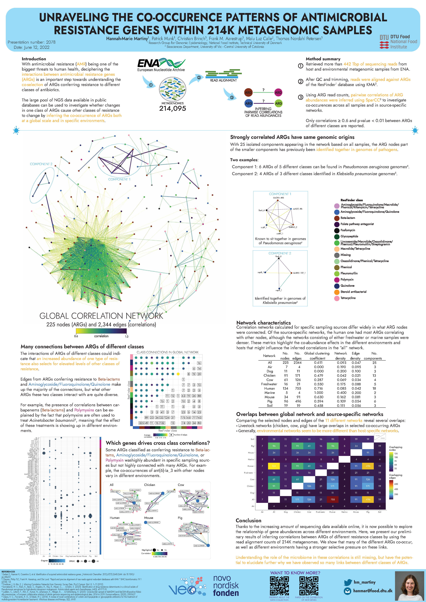

The increasing amount of next-generation sequencing (NGS) data available in public repositories has the potential to provide new ways of monitoring the emergence, evolution, and spread of antimicrobial resistance genes (ARGs) with a large-scale metagenomic analysis.  We have downloaded more than 442 Tbp of sequencing reads from 214,095 host-derived and environmental metagenomes from the European Nucleotide Archive (ENA). After quality-checking and trimming the reads, we aligned them against ARG templates from the ResFinder database. Here, we present our network analysis of the co-occurrence of ARGs across a highly diverse collection of samples to find the evidence of ARGs conferring resistance to different antibiotic classes being co-selected at a global scale. Due to the compositional nature and sparsity of working with counts of aligned read fragments, we applied SparCC on counts to infer pairwise linear correlations. The poster presents the preliminary results to demonstrate the feasibility of a large-scale analysis to investigate the occurrence of cross-resistances in different microbial settings.

