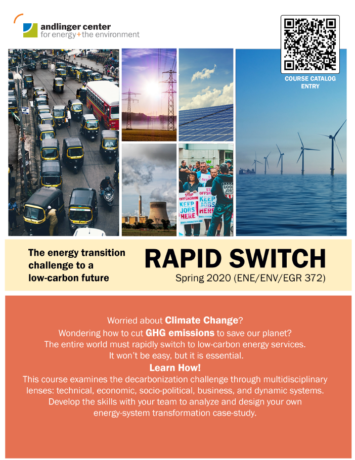

**Lecturer**

ENE 372/EGR 372/ENV 372

Course details can be found at [Princeton Course Catalog](https://registrar.princeton.edu/course-offerings/course-details?term=1204&courseid=015001).

# Course Rationale and Overview
The 2015 Paris Accord signaled a global consensus that climate change is a major threat to ecosystems, livelihoods, and the economy and that energy systems must change. Not well comprehended are the scale and pace of the needed transformation. Bottlenecks and constraints are inevitable with rapid, large-scale change. These must be anticipated and addressed to achieve climate goals – this is the essence of Rapid Switch analysis. In this course, prospective regional and sectoral energy transitions are analyzed through multi-disciplinary lenses to identify bottlenecks and potential solutions and policies to maximize the pace of transition. 

Undergraduates at any level from any department are encouraged to enroll as the more heterogeneous the enrolment, the richer will be the student experience. No detailed knowledge of engineering, science, economics, or social or behavioral science is assumed. Active participation will be required during class discussions and precepts.
Readings and homework assignments will build and test knowledge and application of concepts drawn from multiple disciplines while also making the content of a final team project report.  Each assignment will be completed by your multi-disciplinary team of 3 students working together to develop their final project report analyzing a specific case-study energy transition.  Teams will be guided in their assignments and project development by instructors with backgrounds in social sciences, engineering, systems sciences, and business practice. The case studies will assess vulnerability of a transition to bottlenecks, prioritize the bottlenecks, and develop strategies to relieve bottlenecks so as to accelerate the transition.  

Teams will be formed and case-study topics assigned early in the semester. Each case study will focus on a transition in the power, transportation, or buildings sector that is plausibly part of the larger global transition in the coming decades to a decarbonized energy system.  Some case studies will address transitions for the United States (with a focus on New York State/New York City) and some for India (with a focus on Rajasthan State/Jaipur City). An additional description of case study topics is at the end of this document.

# Sample Reading List
 Grubler, A., Energy transitions research: Insights and cautionary tales

 International Energy Agency, Energy Technology Perspectives

 McKay, David, Sustainable Energy without the hot air

 Forum for the Future, The Five Capitals Model -- a framework for sustainability

 Colvin,R. Witt,G.B., Lacey, J., Approaches to identifying stakeholders in environmental management

 Wilkinson,A. and Kupers,R., Living in the Futures

# Learning Outcomes
Students will learn to:

•	Describe the purpose and methodologies associated with energy transition outlooks and communicate their merits and weaknesses.

•	Use causal loop diagrams to frame, understand, and discuss complex issues emerging from energy–economy–environment interactions.

•	Apply and adapt the 5-Capitals framework to examine the viability of energy transitions.

•	Develop, validate, and apply system dynamics in service of energy policy design and assessment in the twenty-first century.

•	Analyze political, social, and behavioral influences in energy transitions, with a focus on the role of political institutions, interest groups, and the public on energy transitions. Identify stakeholders and design stakeholder engagement strategies to influence change in the energy sector.

•	Frame low-carbon energy investment proposals and apply financial analysis methods to support investment decision-making in light of complexity and uncertainty associated with the rapid transformation of the energy sector.

•	Analyze a specific energy transition scenario for a sector and region to evaluate the potential exposure to constraints or bottlenecks and apply risk and uncertainty assessment methods to prioritize critical bottlenecks.

•	Communicate the role of Scenario Planning as a tool for guiding strategy in an uncertain future and use the outcomes to design high-level strategies for anticipating / resolving / avoiding bottlenecks to sustain and accelerate low-carbon transitions.

•	Work in multi-disciplinary teams, including collectively communicating verbally and in writing.

# Reading/Writing Assignments
 Readings and five homework assignments through week 9 will build and test knowledge and application of concepts drawn from multiple disciplines. Assignments will be completed in small multi-disciplinary teams and provide a foundation for team projects assessing specific energy transitions. The midterm will comprise oral and written presentation of progress and plans for the energy-transition case study. The final will comprise written and oral presentation of the case study.

# Requirements/Grading
Homework assignments, 25%

Draft final project report, 10%

Oral project presentation, 15%

Final report, 40%

Class/Precept Participation, 10%

# Prerequisites and Restrictions
This course is open to any undergraduate student. Enrollment by students from a mix of disciplines will enrich the course experience for all.

# Other Information
Multi-disciplinary teams of 3 students each will undertake research and analysis in the course of their homework assignments and additional work to develop the content of their final project reports. Each case study will be on a regional, sectoral transition that could plausibly be part of the larger global transition to a decarbonized energy system in the coming decades.  Some teams will address transitions for the United States (with a focus on New York State/New York City) and some for India (with focus on Rajasthan State/Jaipur City). The case-study topics derive from either actual or plausible hypothetical plans.

Starting in week 9, the teams will use class time (and outside time) to further develop energy-transition case study analyses, building on prior homework assignments and guided by instructors with backgrounds in social sciences, engineering, systems sciences, and business practice. The case studies will assess vulnerability of a transition to bottlenecks, prioritize the bottlenecks, and develop strategies to relieve bottlenecks so as to accelerate the transition.