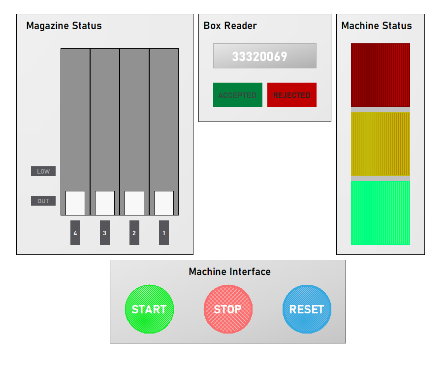

## 3D Filament Pellet Sorter

Worked on a Rockwell PLC with industrial sensing technology, and industrial actuator and developed Supervisory control and data acquisition (SCADA) for the Human-machine interface (Machine: SMC HAS 200).

Videos:\
[Auto Mode](https://drive.google.com/file/d/1nFZ3G9hHAkfYh79k1DYMpi_41WU68J7D/view?usp=drive_link) \
[Manual Mode](https://drive.google.com/file/d/1KCGYvSb65EKQRfCQ9AiHpFBMndduPnzX/view?usp=drive_link)

 
 