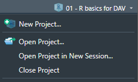

```{r setup, include=FALSE}
knitr::opts_chunk$set(echo = TRUE)
options(repos = c(CRAN = "https://cran.rstudio.com/"))
```

## **Introduction**

During this course, we will exclusively use R for data visualization and analysis, via RStudio.

The open-source programming language R is focused on statistics and data analysis, with several built-in options and example datasets for performing the most common types of analysis. For example, we can perform a regression and plot it to show the relationship between weight and miles per gallon of the cars in the built-in `mtcars` dataset:

```{r}
result <- lm(mpg ~ wt, data = mtcars)
plot(mpg ~ wt, data = mtcars)
abline(result, lty = 2)
```

RStudio is the de-facto standard integrated development environment (IDE) for R: a program that enables us to easily write programs, scripts, documents, and even entire blogs, websites, and journal articles using R in the background.

We assume that you are already familiar with R and RStudio, as outlined in the entry requirements of the course. However, if you haven’t installed R yet on your (current) computer or need some refreshing, please see below on how to install R, RStudio, and some sources to familiarize yourself with the basics.

---

## **RStudio Projects**

A feature we are going to use a lot is RStudio’s projects. A project is a file folder with code, data, and other files related to a single project. An R project folder contains an `.Rproj` file which you can open from RStudio. This automatically sets that folder as the working directory, meaning any files in it can be loaded relative to this directory.

```{r, echo=FALSE, out.width='30%', fig.align='center'}  

```

After opening an R project, RStudio shows the name of the project in the top-right corner of the program, above the environment panel. By clicking on it, you can close it, open another project, create new projects, and quickly access your latest projects. You can also open projects in new RStudio sessions.

---

## **R Markdown**

In this course, we will make extensive use of `.Rmd` files, R Markdown files. With R Markdown files, we can easily create documents that seamlessly combine text, code, and plots. Even the website you are reading right now was generated from an R Markdown file.

If you’re not familiar with R Markdown files, create a new R Markdown file in RStudio using **File > New File > R Markdown**. Play around with the file that appears.

If you scroll through the file, you may see that there is a specific syntax associated with R Markdown files. At the start, there is some information about the document and how it should be output, and in the document itself is the text with a lot of pound signs (`#`), underscores (`_`), and backticks (`\``). If you are still unfamiliar with using R Markdown files, please read through the following tutorials on [rmarkdown.rstudio.com](https://rmarkdown.rstudio.com) before next class:

- **How It Works**
- **Code Chunks**
- **Markdown Basics**
- **Output Formats**
- **Cheatsheets**

RStudio may ask you to install several packages. You should allow it! If these do not install, you should manually install and load the required packages:

```r
install.packages(c("rmarkdown", "knitr", "tidyverse", "tinytex"))
```

Make sure you can output the R Markdown file you created to HTML using **Knit > Knit to HTML** on top of the source pane.

---

## **Code Style**

Throughout this course, try to maintain a consistent and legible style for your code. This is very important as it will make your collaborators, as well as future you, happy. Being able to read and understand your own code after a year of not looking at it is possible if you use consistent style and informative comments where necessary.

Read through the style guide on [Hadley Wickham’s website](https://style.tidyverse.org/).

Tip: In RStudio, you can display a vertical line at 80 characters to know when your code exceeds this. You can do this at **Tools > Global Options > Code > Display > Show margin**.

---

## **Installing R and RStudio**

1. **Install R**  
   R can be obtained [here](https://cran.r-project.org/). We won’t use R directly in the course, but rather call R through RStudio. Therefore, it needs to be installed.

2. **Install RStudio Desktop**  
   RStudio is an Integrated Development Environment (IDE). It can be obtained as standalone software [here](https://www.rstudio.com/products/rstudio/download/). The free and open-source RStudio Desktop version is sufficient. Also, ensure that you have installed a TeX distribution by running the following commands in RStudio:

```r
install.packages("tinytex")
library(tinytex)
install_tinytex()
```

3. **Familiarize Yourself with the Basics**  
   Take a look at [this video](https://www.rstudio.com/resources/webinars/rstudio-essentials/) if you aren’t familiar with RStudio. Since this is not a course on programming with R but rather a course on data analysis and visualization, ensure you are familiar with some basics. To get started:

   - Read the first two chapters of the **Introduction to R** on [DataCamp](https://www.datacamp.com/courses/free-introduction-to-r).
   - Play around with R and read **Workflow Basics** in Hadley Wickham’s book *R for Data Science*.

   You can also try an interactive R course using `swirl`:

```r
install.packages("swirl")
library(swirl)
swirl()
```

   Follow the guide to run the **R Programming: The Basics of Programming in R** interactive course.

---

## **Alternative Options**

If you have trouble installing R and RStudio on your local machine:

1. Open a free account on [rstudio.cloud](https://rstudio.cloud/). You can run your own cloud-based RStudio environment there.
2. Use Utrecht University’s [MyWorkPlace](https://www.uu.nl/en/services/uu-myworkplace). You may need to install packages for new sessions during the course.

**Note:** You will need internet access for these services to be accessed.
