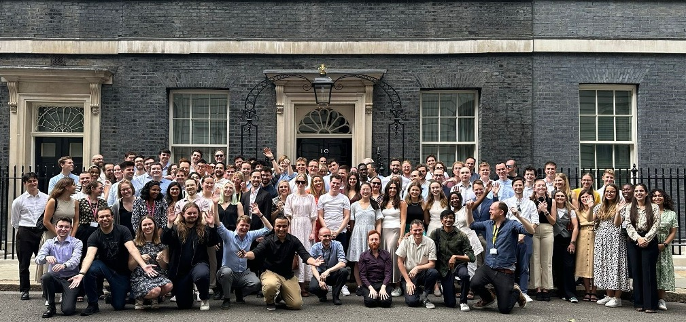
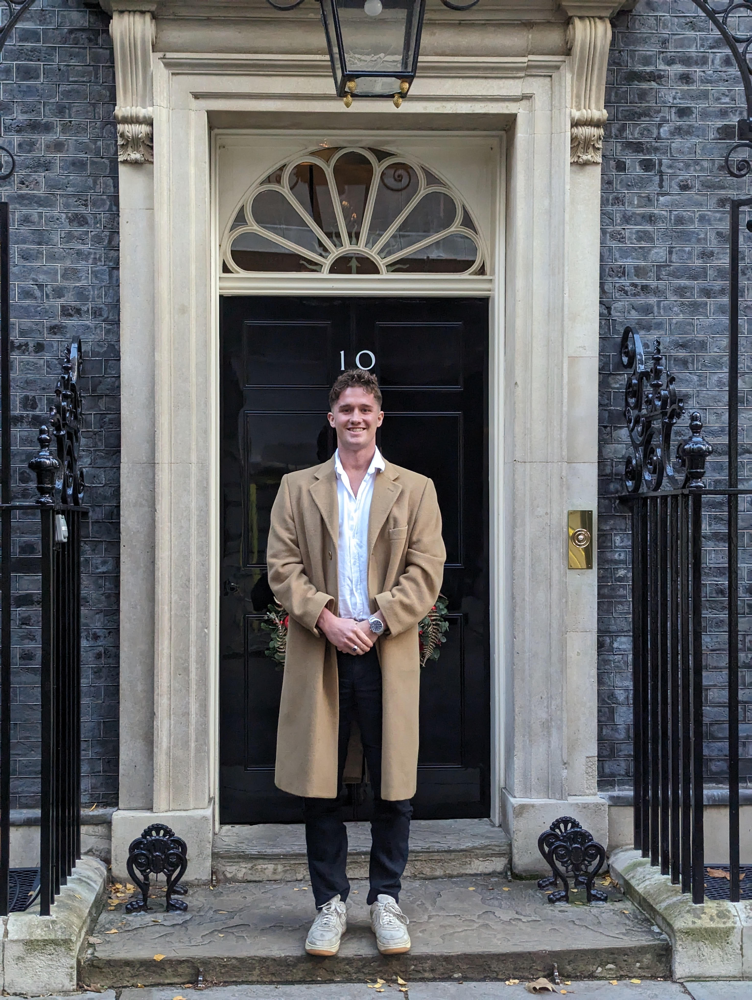
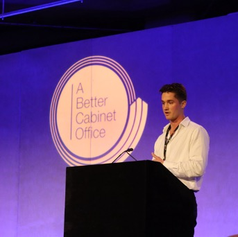

<nav id="side-nav" class="side-nav" aria-label="Section navigation">

<h1 class="sidebar-name">Harry Coppock</h1>

10 Downing Street Fellow &middot; Research Scientist &middot; Visiting Lecturer

HEA Fellow, PhD, PGCert, MSc, MEng

<i class="bi bi-envelope"></i> harrygcoppock [at] gmail [dot] com

<a href="https://github.com/hcoppockno10" target="_blank" rel="noopener" title="GitHub"><i class="bi bi-github"></i></a>
<a href="https://www.linkedin.com/in/harry-coppock/" target="_blank" rel="noopener" title="LinkedIn"><i class="bi bi-linkedin"></i></a>
<a href="https://scholar.google.com/citations?user=sOdVlYoAAAAJ&hl=en" target="_blank" rel="noopener" title="Google Scholar"><i class="bi bi-mortarboard-fill"></i></a>
<a href="files/CV_HC.pdf" target="_blank" rel="noopener" title="CV" class="sidebar-cv-link">CV</a>

<a href="https://calendar.app.google/FdE94HZm6inSqstD7" target="_blank" rel="noopener" class="book-meeting-btn"><i class="bi bi-calendar-check"></i> Let's chat!</a>

<ul class="nav-list">
<li><a href="#Overview" class="nav-link active" data-section="about"> Overview</a></li>
<li><a href="#aisi" class="nav-link" data-section="aisi"> AISI</a></li>
<li><a href="#fellow" class="nav-link" data-section="fellow"> 10 Downing Street</a></li>
<li><a href="#imperial" class="nav-link" data-section="imperial"> Lectureship</a></li>
<li><a href="#health" class="nav-link" data-section="health"> AI for Health</a></li>
</ul>
</nav>

<h1 class="mobile-profile-name">Harry Coppock</h1>

10 Downing Street Fellow &middot; Research Scientist &middot; Visiting Lecturer

HEA Fellow, PhD, PGCert, MSc, MEng

<a href="https://github.com/hcoppockno10" target="_blank" rel="noopener" title="GitHub"><i class="bi bi-github"></i></a>
<a href="https://www.linkedin.com/in/harry-coppock/" target="_blank" rel="noopener" title="LinkedIn"><i class="bi bi-linkedin"></i></a>
<a href="https://scholar.google.com/citations?user=sOdVlYoAAAAJ&hl=en" target="_blank" rel="noopener" title="Google Scholar"><i class="bi bi-mortarboard-fill"></i></a>
<a href="files/CV_HC.pdf" target="_blank" rel="noopener" title="CV" class="sidebar-cv-link">CV</a>
<i class="bi bi-envelope"></i> harrygcoppock [at] gmail [dot] com

<a href="https://calendar.app.google/FdE94HZm6inSqstD7" target="_blank" rel="noopener" class="book-meeting-btn"><i class="bi bi-calendar-check"></i> Let's chat!</a>

::: {#about .content-section}

Hey, welcome to my website 🌱

I am an AI researcher passionate about ensuring AI benefits humanity. To achieve this I work on a broad range of challenges including AI evaluation, development of robust AI capabilities, and reform within Government.

Currently, I am a Research Scientist at the [UK AI Security Institute (AISI)](#aisi), where I was the first technical hire. I am also a [10 Downing Street Fellow](#fellow) where I advise on and lead AI projects addressing Prime Minister priority objectives. Along with this, I am a [Visiting Lecturer at Imperial College London](#imperial) where for one semester a year I teach the Deep Learning course.

Previously, I completed a PhD in AI at Imperial College London and spent time on secondment at [The Alan Turing Institute](https://www.turing.ac.uk/). During my doctorate, I founded Maat, an AI due diligence consultancy that assessed the AI capabilities of companies involved in M&A and VC transactions, working with high-profile clients including Pfizer. Prior to this, I completed an MSc in AI at Imperial College London, following an undergraduate degree in Materials Science and Engineering.

In my spare time, I like to be in nature, working on my partner's farm in Somerset, playing sport with friends and travelling to places that feel different to the UK.

:::

::: {#aisi .content-section}

Research Scientist

---

Since joining [AISI](https://www.aisi.gov.uk/) as its first technical hire in November 2023, I've enjoyed building AISI's AI evaluation capabilities. In this role, I've built out AISI's autonomous and cyber evaluations, primarily involving capture-the-flag-style agentic evals. I've also been directly involved in 20+ frontier model pre-deployment evaluation cycles, working closely with labs such as Anthropic, OpenAI, and Google DeepMind to evaluate harmful capabilities of their models before public release (see our [2025 Frontier AI Trends Report](https://www.aisi.gov.uk/frontier-ai-trends-report) for a redacted overview of these evaluations). To enable this line of work, I have also been involved with open-source evaluation software such as [Inspect AI](https://inspect.aisi.org.uk/), [Hibayes](https://ukgovernmentbeis.github.io/hibayes/), and [Inspect Scout](https://meridianlabs-ai.github.io/inspect_scout/). I've been delighted to see AISI become a world-leading lab, attracting great talent — now 170+ technical individuals — and demonstrating new ways of operating effectively within government.

A significant amount of my time has also been spent improving the science of AI evaluation, ensuring our measures are good indicators of latent capability. A subset of this work which is now public covers a [rigorous framework for agentic benchmarks](https://arxiv.org/pdf/2507.02825), also using [generalised linear models to investigate LLM judge biases](https://arxiv.org/pdf/2507.03772), and more recently on [best practices for scalable oversight or transcription analysis](https://d197for5662m48.cloudfront.net/documents/publicationstatus/309764/preprint_pdf/3ababe0455f322db1773dee4f1c59434.pdf). Internally, I have worked on inference time scaling laws, real world human uplift trials, automatic jailbreak methods and measuring the robustness properties.

<figure class="paper-figure">

<figcaption>Left: the sandbox-within-a-sandbox architecture, which allows us to safely evaluate container escape capabilities. Right: the different vulnerability scenarios we inject, along with difficulty ratings from 1 to 5.</figcaption>
</figure>

A recent paper I enjoyed working on released one of our agentic evals: [Quantifying Frontier LM Capabilities for Container Sandbox Escape](https://arxiv.org/abs/2603.02277). SandboxEscapeBench is a benchmark that measures LLM capacity to breach container sandboxes across a range of vulnerabilities — from misconfigurations and privilege errors to kernel flaws and runtime weaknesses.

:::

::: {#fellow .content-section}

10 Downing Street Innovation Fellow

---

In this Deputy Director role, I work closely with ministers, advising on and leading AI-related opportunities and projects. Alongside [AISI](https://www.aisi.gov.uk/), I contributed to the early work of the [Incubator for Artificial Intelligence](https://ai.gov.uk/), which focused on building technical capability within government and reducing reliance on external procurement to deliver better outcomes for the UK through tech. I have had the privilege of serving across two governments, gaining significant political experience, including through the transition of power from a Conservative to a Labour government following the general election.

:::

::: {#imperial .content-section}

Visiting Lecturer

---

Teaching is something I enjoy, and I'm fortunate to have taught the Deep Learning course in the Department of Computing at Imperial College London for the past three years. I cover topics including efficient deep learning, the science of AI evaluation, scaling laws, generative models, and transformer architectures. You can find recordings of some of my lectures ([Lecture 1](https://youtu.be/Dq0Xt6UpGPA?si=X7ij5GAVl1CKI-WM), [Lecture 2](https://youtu.be/pglSEBikuOA?si=ZjFYBXbI4dWEkNE3)) and a set of [lecture notes](https://hcoppockno10.github.io/lecture-notes/). To support my pedagogical journey, I have completed a PGCert in Higher Education, am a Fellow of the Higher Education Academy (HEA), and am actively involved in faculty working groups to ensure the department's teaching methods adapt appropriately to AI advancements.

:::

::: {#health .content-section}
## AI for Health

Ensuring the public has access to the best possible healthcare through the NHS is a key objective of mine. I actively work towards this goal by pursuing advancements in AI for healthcare, rigorously validating their clinical utility, and working to position the NHS to maximise its chances of adopting these technological advances for public benefit.

A example contribution of mine was a paper in [Nature Machine Intelligence](https://www.nature.com/articles/s42256-023-00773-8) demonstrating that a widely accepted technology — with hundreds of millions of pounds invested — purporting to diagnose COVID status from respiratory audio was in fact driven by confounders and provided no additional clinical utility over simple symptom checkers.

I have also led a [study](https://arxiv.org/pdf/2512.21127) in the NHS investigating barriers to using frontier LLMs for medication safety reviews ([demo of use case](https://hcoppockno10.github.io/nhfm-demo/)). Medication errors account for half of all avoidable medication-related harm, making this an important area of work. However, we found poor translation from synthetic and medical-style QA benchmarks to real-world clinical workflows, as illustrated in the figure below. Next, I hope to work on progressing post-training methods, addressing the spiky capability landscape of current AI, ensuring better and more robust real-world outcomes for AI.

Currently, I am campaigning within the NHS for it to strengthen its technical capability — both to develop its own AI technologies and to enable it to procure external solutions in a way that avoids vendor lock-in and ensures only the highest quality products are deployed for patient care.

<figure class="paper-figure">

<figcaption>Taxonomy and examples of system failures. Classification of the 178 failure instances into five failure reasons and their corresponding failure modes. Representative vignettes for each failure type showing the clinical scenario, system output, and clinician assessment.</figcaption>
</figure>

:::

