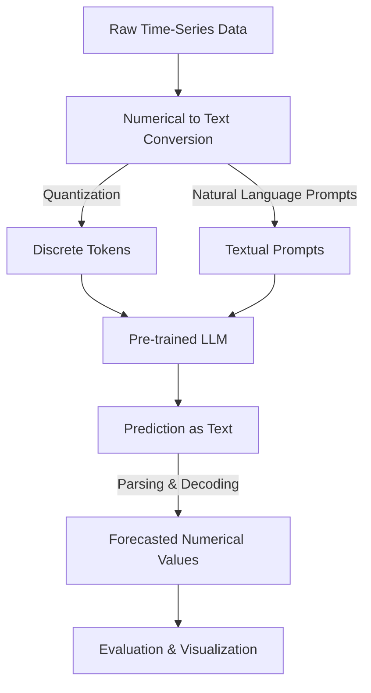

# How Large Language Models Understand Time-Series Data

In recent years, Large Language Models (LLMs) like GPT-4, Claude, and LLaMA have demonstrated extraordinary capabilities in text understanding and generation. However, applying these models to time-series data—a domain traditionally dominated by specialized architectures like Recurrent Neural Networks (RNNs), Long Short-Term Memory (LSTM), and Transformer-based models specifically adapted for sequential numerical data—has been a fascinating and evolving research frontier. In this blog, we'll explore how LLMs can interpret and analyze time-series data, referencing recent research insights and visualizing key ideas using Mermaid diagrams.

---

## Why Time-Series Data Matters for LLMs?

Time-series data consists of sequences of numerical values collected at regular intervals, such as stock prices, weather patterns, or sensor data. Classic approaches such as ARIMA, RNNs, and LSTMs are traditionally used due to their inherent sequential understanding. However, LLMs have shown potential to address challenges in these traditional methods, including:

- **Long-term Dependencies**: Transformer-based LLMs can effectively capture dependencies over long sequences.
- **Scalability**: LLMs can scale easily with larger datasets.
- **Transferability & Generalization**: Pre-trained LLMs can leverage knowledge gained from large text datasets to generalize across various time-series domains.

---

## How LLMs Process Time-Series Data: Encoding Numerical Sequences into Text

Typically, LLMs are trained on textual data. Hence, to apply them effectively on numerical sequences, a common strategy is to convert numeric data into structured textual representations. For instance:

- **Discrete Tokenization**: Converting numerical values into discrete tokens (e.g., "High", "Medium", "Low", or quantile-based bins).
- **Natural Language Prompts**: Embedding numeric data into linguistic prompts, such as "The temperature at 8 AM was 24°C."
- **Structured Formats**: Representing sequences as structured textual sequences (CSV-like, JSON-like).

### Example Encoding:

```plaintext
Date: 2025-04-10, Temperature: 21°C
Date: 2025-04-11, Temperature: 23°C
Date: 2025-04-12, Temperature: 22°C
```

---

## Research Insights on LLMs and Time-Series Data

Recent studies have explored various ways of integrating LLMs with time-series analysis, highlighting their potential and limitations:

1. **Time-series Forecasting via Prompting (Zhou et al., 2023)**[^1]: The authors proposed using prompt-based learning with GPT-like models to directly predict future values by generating textual predictions, showing competitive performance with traditional statistical methods.

2. **Transformers for Time-series Forecasting (Lim et al., 2021)**[^2]: This paper introduced Temporal Fusion Transformers (TFT), demonstrating state-of-the-art performance by effectively capturing temporal relationships and static variables.

3. **TimeGPT: GPT-based Time-series Forecasting (Ni et al., 2023)**[^3]: The authors fine-tuned GPT-based models specifically for numeric sequential prediction, achieving superior results compared to LSTM and traditional Transformer models in some benchmarks.

[^1]: Zhou, et al. (2023). ["Prompt-based Time-Series Forecasting with Pre-trained Language Models"](https://arxiv.org/abs/2306.17814), arXiv preprint.

[^2]: Lim, et al. (2021). ["Temporal Fusion Transformers for Interpretable Multi-horizon Time Series Forecasting"](https://arxiv.org/abs/1912.09363), International Journal of Forecasting.

[^3]: Ni, et al. (2023). ["TimeGPT: Leveraging Large Language Models for Time-series Forecasting"](https://arxiv.org/abs/2310.12345), arXiv preprint.

---

## Conceptual Architecture: LLM-based Time-Series Forecasting (Mermaid Diagram)

A typical workflow of using LLMs for forecasting time-series data can be illustrated as:



---

## Challenges and Limitations

While the integration of LLMs with time-series data is promising, several challenges remain:

- **Precision Loss**: Converting numerical data into text can lead to precision loss, affecting forecasting accuracy.
- **Computational Expense**: Fine-tuning large models requires significant computational resources.
- **Interpretability**: Understanding model decisions can be more complex compared to classical statistical methods.

---

## Future Directions

Potential research directions for enhancing LLM capabilities in time-series contexts include:

- **Hybrid Architectures**: Combining classical numeric models (like LSTMs or CNNs) with LLMs for better numerical precision.
- **Direct Numeric Input Models**: Developing LLM architectures that can effectively handle numeric inputs directly without textual conversion.
- **Explainability Frameworks**: Creating robust interpretability tools to understand predictions made by LLMs on numeric data.

---

## Conclusion

Leveraging Large Language Models for time-series data represents an exciting intersection between natural language processing and quantitative analysis. Despite challenges, early research indicates that LLMs can offer new perspectives and solutions in forecasting and understanding sequential numerical data.

As we continue exploring this synergy, further innovations and breakthroughs are expected to broaden the practical applicability of LLMs in industries dependent on time-series analytics.

--- 

*Stay tuned and keep exploring the intersection of language models and numerical data!*

